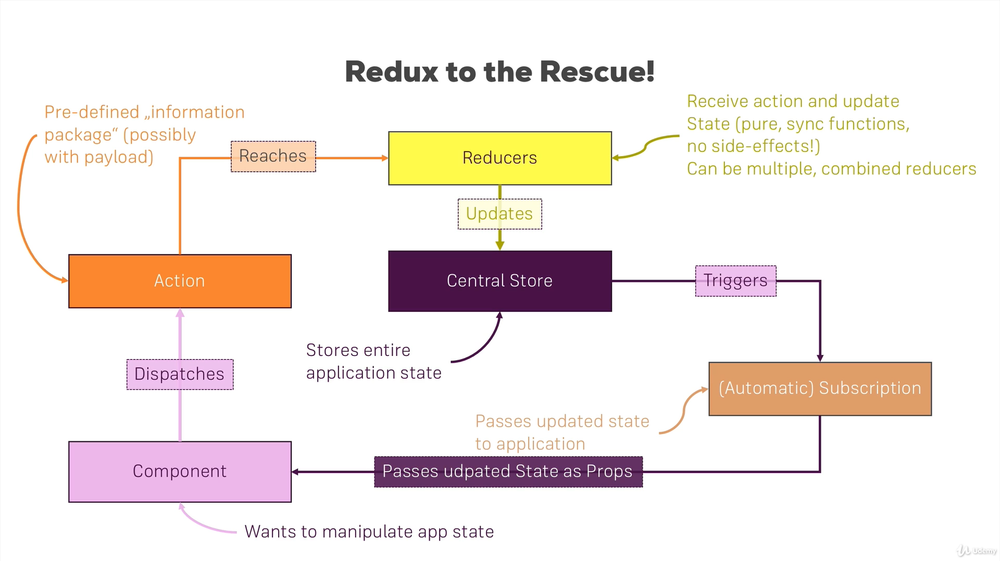
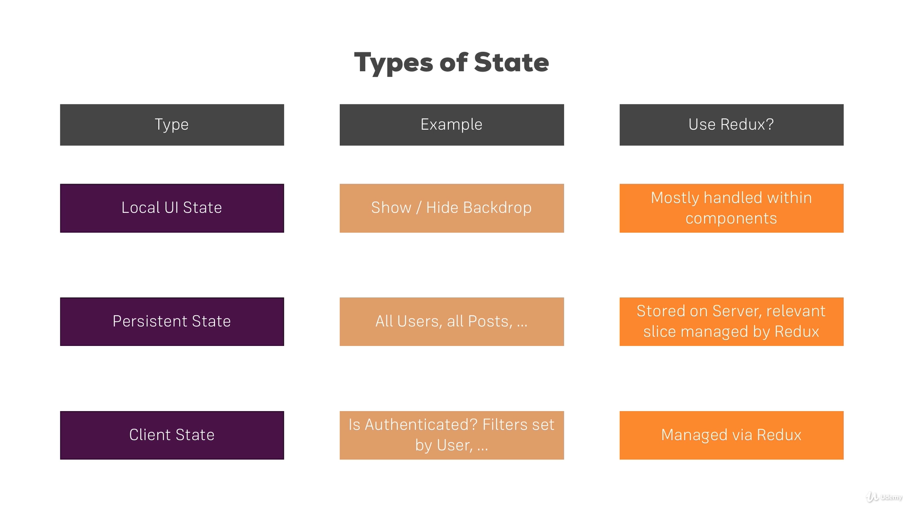

<div style="display: inline-block;">
<a class="link" href="http://oclipa.github.io/">&lt; home</a>
<a class="link" href="http://oclipa.github.io/toolbox.html">&lt; toolbox</a>
</div> 

## ReactJS

**Recommended Course:**
   * **[React - The Complete Guide (incl Hooks, React Router, Redux)](https://www.udemy.com/course/react-the-complete-guide-incl-redux/)**

-------------------------------------------------------------------------------------------------------

<button type="button" id="toggle-all" value="none">Expand All Sections</button>

-------------------------------------------------------------------------------------------------------

### In Theory

<div id="howto">
<button type="button" class="collapsible">+ How To Approach Building An App In React</button>
<div class="content" style="display: none;" markdown="1">

**Based on: [https://reactjs.org/docs/thinking-in-react.html](https://reactjs.org/docs/thinking-in-react.html)**

1. Break data model into components that (ideally) only do one thing.
   * [Single Responsibility Principle](https://en.wikipedia.org/wiki/Single-responsibility_principle)
1. Break down UI into components, where each component matches one piece of the data model.
1. Arranage UI components into a hierarchy.
1. Build a static version of the hierarchy in React.
   * At this stage, use `props` rather than `state` (see "[What is the difference between state and props](https://reactjs.org/docs/faq-state.html#what-is-the-difference-between-state-and-props)").
   * Each component should only have a render() method (since it is static).
   * Generally, build bottom-up (i.e. low level of heirarchy first) and write tests as you build.
   * Data will be input as a `prop` into the top of the hierarchy, e.g. in index.js:
      * `ReactDOM.render(<App data="dataSource" />, document.getElementById('root'));`
1. Identify the minimum set of mutable (i.e. changeable) state required by the app.
   * [Don't Repeat Yourself Principle](https://en.wikipedia.org/wiki/Don%27t_repeat_yourself)
   * e.g. it is good for state to reference an array, but not the number of items in the array.
   * Three questions:
      * Is it passed in from a parent via props? If so, it probably isn’t state.
      * Does it remain unchanged over time? If so, it probably isn’t state.
      * Can you compute it based on any other state or props in your component? If so, it isn’t state.
1. Identify which component mutates, or owns, the state.
   * For each piece of state in your application:
      * Identify every component that renders something based on that state.
      * Find a common owner component (a single component above all the components that need the state in the hierarchy).
      * Either the common owner or another component higher up in the hierarchy should own the state.
      * If you can’t find a component where it makes sense to own the state, create a new component solely for holding the state and add it somewhere in the hierarchy above the common owner component.
   * The owner of the `state` will pass it to components that need it via `props`. 
   * Components that mutate state should avoid UI rendering.
1. Add inverse data flow (i.e. from lower hierarchy to higher).
   * Components should only update their own state.
   * Pass callbacks (e.g. `onChange` event) from higher components to lower components, which will fire when the state should be updated.  
   * The callbacks will call `setState()`.

</div>
</div>

<div id="design">
<button type="button" class="collapsible">+ React Design Principles</button>
<div class="content" style="display: none;" markdown="1">

**Based on: [https://reactjs.org/docs/design-principles.html](https://reactjs.org/docs/design-principles.html)**

1. The key feature of React is composition of components.
   * Components should be able to be changed without affecting the rest of the codebase.
   * Components describe any composable behaviour, which includes rendering, lifecycle and state.
1. Resist adding features that can be implemented by clients.
   * [Minimal API Surface Area](https://www.youtube.com/watch?v=4anAwXYqLG8)
   * Only add out-of-scope features if it will avoid clients producing multiple solutions to the same problem.
1. Before deprecating a feature, always consider all use cases and communicate reasons and alternatives to clients.
1. If some pattern is hard to express in a declarative way, provide an imperative API.
1. If you can't identify a perfect API, provide a temporary subpar API (but it must be temporary).
1. Value API stability.
   * When something changes, there should be a clear (and preferably automated) migration path.
   * Deprecate APIs internally first, before deprecating them for clients (to allow validation).
   * Add deprecation warnings in the current major version and change the behaviour in the following major release.
   * Consider using [codemod](https://www.youtube.com/watch?v=d0pOgY8__JM) scripts for changes that require a lot of repetitive manual work.
1. Value interoperability.
   * Enable gradual adoption by allowing existing functionality to be wrapped by new functionality.
1. Perform the minimum amount of work before returning to React.
   * Allows React to schedule and split work.
1. Be renderer-agnostic
   * Don't assume the app will only run in a browser.
   * e.g. [https://reactnative.dev](React Native)
1. Aim for elegant APIs but prefer ugly APIs if they avoid work for the client.
   * Correct, performant and a good developer experience are more important than elegant.
1. Prefer boring code to clever code.
   * Avoid new internal abstractions.
   * Verbose code is easier to move around and change.
1. Use verbose name for APIs.
   * Make points of interaction highly visible and distinct.
   * Optimize for search (makes automated updates easier).
1. [Eat Your Own Dog Food](https://en.wikipedia.org/wiki/Eating_your_own_dog_food)
   * But be open to the idea that external clients may have other use cases.

</div>
</div>

<div id="patterns">
<button type="button" class="collapsible">+ React Patterns</button>
<div class="content" style="display: none;" markdown="1">

There are many patterns that are considered important for React; certainly too many to list here.  

A good sources of information about React Patterns is:
   * [https://vasanthk.gitbooks.io/react-bits/](https://vasanthk.gitbooks.io/react-bits/)

Additional information can be found here:
   * [https://reactpatterns.com/](https://reactpatterns.com/)

Some examples of common patterns can be found here:
   * [https://github.com/reactjs/react-future/tree/master/07%20-%20Returning%20State](https://github.com/reactjs/react-future/tree/master/07%20-%20Returning%20State)

</div>
</div>

<div id="practices">
<button type="button" class="collapsible">+ Best Practices List (WIP)</button>   
<div class="content" style="display: none;" markdown="1">

**Taken from [https://medium.com/@konstankino/2019-reactjs-best-practices-design-patterns-516e1c3ca06a](https://medium.com/@konstankino/2019-reactjs-best-practices-design-patterns-516e1c3ca06a)**

* When using ReduxJS, split your Reducer code into smaller methods to avoid huge JSON within your Reducer.
* Consider using TypeScript in your apps if you do not do it already.
* Use the create-react-app generator to bootstrap your ReactJS app.
* Keep your code DRY. Don’t Repeat Yourself, but keep in mind code duplicate is NOT always a bad thing.
* Avoid having large classes, methods or components, including Reducers.
* Use more robust managers to manage application state, such as Redux.
* Use event synchronizer, such as Redux-Thunk, for interactions with your back end API.
* Avoid passing too many attributes or arguments. Limit yourself to five props that you pass into your component.
* Use ReactJS defaultProps and ReactJS propTypes.
* Use linter, break up lines that are too long.
* Keep your own jslint configuration file.
* Always use a dependency manager with a lock file, such as NPM or yarn.
* Test your commonly accessed code, code that is complex and prone to bugs.
* Write more tests that give more test coverage for your code with a little effort and test code to ensure its proper functioning.
* Every time you find a bug, make sure you write a test first.
* Use function-based components by starting to use React Hooks, a new ReactJS way to create state-full components.
* Use ES6 de-structuring for your props.
* Use conditional rendering.
* User `map()` to collect and render collections of components.
* Use partial components, such as `<>` … `</>`
* Name your event handlers with handle prefixes, such as `handleClick()` or `handleUpdate()`.
* Use `onChange` to control your inputs, such as `onChange={this.handleInputChange}`.
* Use JEST to test your ReactJS code.

</div>
</div>

------------------------------------------------------------------------------------------------------

### In Practice

<div id="nodejs">
<button type="button" class="collapsible">+ Using NodeJS and create-react-app</button>
<div class="content" style="display: none;" markdown="1">

1. To install NodeJS:
   * Either, download the installer from the NodeJS website: [https://nodejs.org](https://nodejs.org)
   * Or, if using MacOS, install using HomeBrew: `brew install node`
   * Or, if using Zsh on Unbuntu (if using Bash, just replace `zsh` with `bash` and `.zshrc` with `.bash_profile`):
      1. `sudo apt-get update`
      1. `sudo apt-get upgrade`
      1. `sudo apt-get install build-essential`
      1. `curl -o- https://raw.githubusercontent.com/nvm-sh/nvm/v0.35.3/install.sh | zsh`
      1. Restart prompt (if there problems are reported with .bashrc, check the permissions on .bashrc)
      1. `nvm install --lts`
      1. `nvm use --lts`
      1. `echo "nvm use --silent --lts" >> .zshrc`
      
1. Install create-react-app (might not need `sudo`): 
   * `[sudo] npm install create-react-app -g`
1. Create a new app: 
   * `create-react-app [app-name] [--scripts-version version]`
   * This will create a new sub-directory of the current directory called `app-name`.
   * `--scripts-version version` is optional; if not used, the latest version of create-react-app will be used.
1. Install an existing app (which has an existing package.json file): 
   * In the app root folder run: `npm install`
1. In the new app directory, start the development server: 
   * `npm start`
   * This actually calls a bespoke command defined in package.json.

</div>
</div>

<div id="npm">
<button type="button" class="collapsible">+ Popular NPM Packages</button>   
<div class="content" style="display: none;" markdown="1">

**Globally Installed**

* `[sudo] npm install create-react-app -g`
  * Command-line tool that creates the basic framework for a react app.
* `[sudo] npm install yarn -g`
  * Command-line tool that creates the basic framework for a react app.

**Locally Installed Production (i.e. per project; required for production)**

* `npm install prop-types`
   * Enables use of PropTypes for validation of properties
* `npm install radium`
   * Uses an HOC that can be used to style components.
   * Requires pseudo-CSS for inline CSS (the same as standard react).
* `npm install styled-components`
   * Uses tagged template literals to style components.
   * Allows inline CSS to be specified as normal (rather than in the pseudo-CSS required by standard React or Radium).
   * Doesn't really allow a clear separation between style and logic.
* `npm install axios`
   * This is a promise-based HTTP client.
* `npm install react-router-dom`
   * Enables routing
* `npm install redux`
   * Enables enhanced state management
* `npm install react-redux`
   * Allows redux store to be hooked up to react application
* `npm install redux-thunk`
   * Enables both complex synchronous logic and simple asynchronous logic when accessing a redux store.

**Locally Installed Development (i.e. per project; only required for development)**
* `npm install eslint --save-dev`
   * Linting tool for javascript
   * NOTE: this is included as a dependency of `create-react-app` and so can be skipped if CRA is installed.
* `npm install prettier --save-dev`
   * Code formatter
* `npm install eslint-config-prettier --save-dev`
   * Allows ESLine and Prettier to work together

</div>
</div>

<div id="simple-app">  
<button type="button" class="collapsible">+ Example of a Simple App</button> 
<div class="content" style="display: none;" markdown="1">

### index.js 

**(boiler-plate code generated by create-react-app)**

```jsx
import React from 'react';
import ReactDOM from 'react-dom';
import './index.css';
import App from './App';
import * as serviceWorker from './serviceWorker';

ReactDOM.render(
  <React.StrictMode>
    <App />
  </React.StrictMode>,
  document.getElementById('root')
);

// If you want your app to work offline and load faster, you can change
// unregister() to register() below. Note this comes with some pitfalls.
// Learn more about service workers: https://bit.ly/CRA-PWA
serviceWorker.unregister();

```

### App.js 

**(created from template generated by create-react-app)**

```jsx
// imports ////////////////////////////////////////////////////

import React, { Component } from 'react';
import ReactDOM from 'react-dom';
import './App.css';
import Calculator from './Calculator/Calculator.js';

// App class //////////////////////////////////////////////////

class App extends Component {
  
  // application state ////////////////////////////////////////

  state = {
    algName: 'None',
    val1: 0,
    val2: 0
  };
  
  // event handlers and functions /////////////////////////////

  val1ChangedHandler = ( event ) => {
    this.setState( 
        {
          algName: "None",
          val1: event.target.value
        } 
      );
  };

  val2ChangedHandler = ( event ) => {
    this.setState( 
        {
          algName: "None",
          val2: event.target.value
        } 
      );
  };
  
  doCalculationHandler = ( event ) => {
    this.setState( 
        {
          algName: event.target.value
        } 
      );
  };

  // render ////////////////////////////////////////////////////

  render() {
    // local style /////////////////////////////////////////////
    const style = {
      backgroundColor: 'green',
      color: 'white',
      font: 'inherit',
      border: '1px solid blue',
      padding: '8px',
      cursor: 'pointer'
    };
    
    let a = this.state.algName;
    let v1 = this.state.val1;
    let v2 = this.state.val2;

    let calc = (<Calculator algName={a} val1={v1} val2={v2} />);

    return (
      <div className="App"> {/* required */} 
        <div className="inputs">
            <input type="text" 
                    onChange={(event) => 
                                this.val1ChangedHandler(event)} 
                    value={v1} />
            
            <input type="text" 
                    onChange={(event) => 
                                this.val2ChangedHandler(event)} 
                    value={v2} />
            
            <div className = "buttons">
              <button style={style} 
                      onClick={(event) => 
                                this.doCalculationHandler(event)}
                      value="add">Add</button>
              <button style={style} 
                      onClick={(event) => 
                                this.doCalculationHandler(event)}
                      value="subtract">Subtract</button>
            </div>
        </div>
        <div className="output">
          {calc}
        </div>
      </div>
    );
  }
}

export default App;
```

### Calculator/Calculator.js

**(created manually)**

```jsx
import React from 'react';
import './Calculator.css';

const calculator = (props) => {
    
    const algName = props.algName;
    const val1 = parseFloat(props.val1);
    const val2 = parseFloat(props.val2);
    
    let result = 0;
    
    if (algName === 'add') {
      result = val1 + val2;
    }
    else if (algName === 'subtract') {
      result = val1 - val2;
    }
    else if (algName === 'None') {
      return <span></span>
    }
    
    return (
        <span>Result = {result}</span>
    )
};

export default calculator;
```
</div>
</div>

<div id="dom">
<button type="button" class="collapsible">+ Virtual DOM</button>   
<div class="content" style="display: none;" markdown="1">

It is important to note that, when render() is called for an app (or a functional component returns), React creates a Virtual DOM ([Domain Object Model](https://www.w3schools.com/whatis/whatis_htmldom.asp)); it does not automatically update the real DOM (i.e. the UI).  This is for performance reasons (updating the real DOM is potentially expensive).

Once generated, the new Virtual DOM is compared to the previous Virtual DOM to see if anything has changed.  In the event something has changed, the real DOM is updated with the changes in the new Virtual DOM, and the UI redrawn.  If nothing has changed, the UI is not updated.
</div>
</div>
  
<div id="components">
<button type="button" class="collapsible">+ Functional vs Class Components</button>   
<div class="content" style="display: none;" markdown="1">

**Both Functional and Class components should start with an uppercase letter.**

Class components should be used if the component is stateful, or there is a need to use lifecycle methods (e.g. `componentDidMount()`).

&nbsp;

-------------------------------------------------------------------------------------------------------

### Functional Component

```jsx
// ES5
function Welcome(props) {
  return <h1>Hello, {props.name}</h1>;
}

// ES6
const Welcome = (props) => {
  return <h1>Hello, {props.name}</h1>;
}
```

&nbsp;

* Functional components do not access props via `this`(e.g. `props.XY`).

Pros:

* Functional components are generally considered easier to read and test.
* Code tends to be smaller.
* It is easier to separate container and presentational components.
* There may be a performance boost in future React versions.

Cons:

* You cannot call setState() in a functional component.
   * As of React 16.8, you can use useState() but this only allows you to overwrite the state, rather than merging updates into the existing state.
* You cannot use lifecycle hooks in a functional component.
   * As of React 16.8, you can use useEffect() however this is not as fine-grained as lifecycle hooks.
   * useEffect() allows you to perform an action after render() has been called.

&nbsp;

-------------------------------------------------------------------------------------------------------

**useEffect()**

* `import React, {useEffect} from 'react';`
* Takes a function that will run for every render cycle.
  * `useEffect( () => { somefunction; }); )`
* Can have multiple calls to useEffect in the same function (e.g. each reacting to different object).
* Essentially, componentDidMount and componentDidUpdate combined in one effect (see below).
* Controlled by passing an object (or array of objects) into the method and the method only reacts if the object has changed:
  * `useEffect( () => { somefunction; }, [props.somedata] ); )`
  * To have the method run only the first time an object is rendered, pass an empty array.
* To perform clean-up using useEffect, return a function:
  * `useEffect( () => { somefunction; return () => { cleanupfunction }; }, [props.somedata] );`
  * Runs BEFORE the main useEffect function runs, but AFTER the (first) render cycle.
  * If an empty array is passed, the cleanup function will only run when the component is unmounted (destroyed).

&nbsp;

-------------------------------------------------------------------------------------------------------

### Class Component

```jsx
class Welcome extends React.Component {
  render() {
    return <h1>Hello, {this.props.name}</h1>;
  }
} 
```

* Class components must access state and props using `this`(e.g. `this.state.XY`).

* As a general of thumb, class components are preferred if you need fine-grained control of state, or you need actions performed outside of render() and you do not want to use React Hooks.

&nbsp;

-------------------------------------------------------------------------------------------------------

**Class Component LifeCycle**

1. This is only available to Class components.
1. Lifecycle Hooks have nothing to do with React Hooks!

<a href="assets/reactjs-component-lifecycle.png" target="_blank" style="width: 80%"></a>

<br/>[Original Image](https://twitter.com/dan_abramov/status/981712092611989509/photo/1)
&copy; Dan Abramov: [https://overreacted.io/](https://overreacted.io/)
<br/>[Interactive Version](http://projects.wojtekmaj.pl/react-lifecycle-methods-diagram/)

* **Mounting**
   1. `constructor()`
      * Call super(props)
      * Use to set up state
      * Don't cause Side-Effects
   1. `getDerivedStateFromProps(props, state)`
      * Sync state with props
      * Very niche case
      * Don't cause Side-Effects
   1. `render()`
      * Prepare and Structure your JSX code
      * Don't do any actions that will block the rendering process.
      * Only completes after render() has been called for all children.
   1. `componentDidMount()` &lt;-- Commonly used
      * Very common 
      * Can cause Side-Effects (e.g. send http requests)
      * Don't update state (at least, not synchronously)
      * **Only called when a component is first mounted; use componentDidUpdate() if component is already displayed**
   1. `componentWillMount()`
      * Available but deprecated
      * Do not use

* **Updating**
   1. `getDerivedStateFromProps(props, state)`
      * See above
   1. `componentWillReceiveProps(props)`
      * Available but deprecated
      * Do not use
   1. `shouldComponentUpdate(nextProps, nextState)` &lt;-- Commonly used
      * Used to cancel update process (even if Virtual DOM changes)
      * Typically used for performance reasons, but needs to be used sparingly.
      * e.g. `return nextProps.property !== this.props.property`
      * For a functional equivalent to this, see [React.memo()](https://reactjs.org/docs/react-api.html#reactmemo).
   1. `render()`
      * See above
   1. `getSnapshotBeforeUpdate(prevProps, prevState)`
      * Another niche method
      * Last minute DOM operations (e.g. getting current scrolling position of user)
      * Don't cause Side-Effects
   1. `componentWillUpdate()`
      * Available but deprecated
      * Do not use
   1. `componentDidUpdate()` &lt;-- Commonly used
      * Can cause Side-Effects (e.g. send http requests)
      * Don't update state (at least, not synchronously)
      * **Only called when a component is already displayed; use componentDidMount() if component is not yet displayed**

* **Unmounting (clean-up)**
   * `componentWillUnmount()`
   
* **Other**
   * `componentDidCatch()`

</div>
</div>

<div id="pure">
<button type="button" class="collapsible">+ PureComponents</button>   
<div class="content" style="display: none;" markdown="1">

* A [`PureComponent`](https://reactjs.org/docs/react-api.html#reactpurecomponent) is essentially the same as a `Component` except that it checks to see if either the props or state has changed before allowing the Virtual DOM to be updated. 
   * i.e. This is a replacement for `shouldComponentUpdate()` (which will ignored for a `PureComponent`).
   * Note that all children must extend `PureComponent`.

```jsx
import React, { PureComponent } from 'react';

class App extends PureComponent {
  
  ...
  
  render() {
    ...
  };
}
```
</div>
</div>

<div id="adjacent">
<button type="button" class="collapsible">+ Adjacent Elements</button>   
<div class="content" style="display: none;" markdown="1">

The `render()` method does not allow adjacent elements (i.e. ones with the same root) to be returned, e.g.

```jsx
return (
    <p onClick={
      this.props.click
    }>
      I'm {this.props.name} and 
      I am {this.props.age} years old!
    </p>
    <p>{this.props.children}</p>
    <input 
      type="text" 
      onChange={this.props.changed} 
      value={this.props.name} 
    />
)
```
There are several ways around this:

&nbsp;

-------------------------------------------------------------------------------------------------------

* Using a root element that wraps all other elements:

```jsx
return (
    <div>
      <p onClick={
        this.props.click
      }>
        I'm {this.props.name} and 
        I am {this.props.age} years old!
      </p>
      <p>{this.props.children}</p>
      <input 
        type="text" 
        onChange={this.props.changed} 
        value={this.props.name} 
      />
    </div>
)
```

&nbsp;

-------------------------------------------------------------------------------------------------------

* Using square brackets (so that an array is being returned), however the elements being returned need to be delimited by commas.  Also, a `key` needs to be specified for each element:

```jsx
return (
    [
      <p key="i1" onClick={
        this.props.click
      }>
        I'm {this.props.name} and 
        I am {this.props.age} years old!
      </p>
      <p key="i2">{this.props.children}</p>
      <input
        key="i3"
        type="text" 
        onChange={this.props.changed} 
        value={this.props.name} 
      />
    ]
)
```

&nbsp;

-------------------------------------------------------------------------------------------------------

* Using a Wrapper function that wraps all other elements.
   * Caveat: In some places this function is referred to as `Aux`, however this is a reserved word on Windows and should be avoided (unless you can guarantee that Windows will never be used for development).

*Wrapper.js*

```jsx
import React from 'react';

const wrapper = props => props.children;

export default wrapper;
```

*Person.js*

```jsx
import Wrapper from '../../../hoc/Wrapper';

...

render() {
  return (
      <Wrapper>
        <p onClick={
          this.props.click
        }>
          I'm {this.props.name} and 
          I am {this.props.age} years old!
        </p>
        <p>{this.props.children}</p>
        <input 
          type="text" 
          onChange={this.props.changed} 
          value={this.props.name} 
        />
      </Wrapper>
  );
}
```

&nbsp;

-------------------------------------------------------------------------------------------------------

* Using React.Fragment:

Since React 16.8, there is a built-in version of `Wrapper` called `React.Fragment`:

*Person.js*

```jsx
import React, { Component, Fragment } 
        from 'react';
...

render() {
  return (
      <Fragment>
        <p onClick={
          this.props.click
        }>
          I'm {this.props.name} and 
          I am {this.props.age} years old!
        </p>
        <p>{this.props.children}</p>
        <input 
          type="text" 
          onChange={this.props.changed} 
          value={this.props.name} 
        />
      </Fragment>
  );
}
```
</div>
</div>

<div id="hoc">
<button type="button" class="collapsible">+ Higher Order Components (HOC)</button>   
<div class="content" style="display: none;" markdown="1">

The `Wrapper`and `Fragment` components are examples of Higher Order Components.  This means that they wrap another component and add specific, limited functionality to the wrapped component.

There is a general convention to name HOCs with a `With` at the beginning, and place them in an `hoc` folder.

There are two approaches to defining HOCs:

&nbsp;

-------------------------------------------------------------------------------------------------------

* Return a jsx functional component.
   * This approach is recommended when changing the HTML code or styling.

*hoc/WithClass.js (upper-case 'W' to indicate this is a component, not function)*

```jsx
import React from 'react';

const withClass = props => (
  <div className={props.classes}>
    {props.children}
  </div>
);

export default withClass;

```

*containers/App.js*

```jsx
class App extends Component {
  import React from 'react';

  // upper-case 'W' to indicate this 
  // is a component, not a function
  import WithClass from '../hoc/WithClass';
  
  ...
 
  render() {
    return (
      <WithClass classes={styles.App}>
        ...
      </WithClass>
    );
  } 
}

export default App;
```

&nbsp;

-------------------------------------------------------------------------------------------------------

* Return a javascript function that returns a jsx functional component:
  * This approach is recommended for adding behind-the-scenes logic, e.g. error handling or sending analytic data.

*hoc/withClass.js (lower-case 'w' to indicate this is a function, not component)*

```jsx
import React from 'react';

const withClass = 
  (WrappedComponent, className) => {
    return props => (
      <div className={className}>
        <WrappedComponent {...props} />}
      </div>
  );
};

export default withClass;

```
*containers/App.js*

```jsx
class App extends Component {
  import React from 'react';
  
  // lower-case 'w' to indicate this 
  // is a function, not component
  import withClass from '../hoc/WithClass';
  import Wrapper from '../hoc/Wrapper';
  
  ...
 
  render() {
    return (
      <Wrapper>
        ...
      </Wrapper>
    );
  } 
}

export default withClass(App, styles.App);
```

</div>
</div>

<div id="state">
<button type="button" class="collapsible">+ Props & State</button>   
<div class="content" style="display: none;" markdown="1">

There are two approaches to handling application state:
   * `state`
   * `props`

&nbsp;

-------------------------------------------------------------------------------------------------------

**state**

* `state`, as the name suggests, records the current state of a **class** component.
* Not all components need to have state (it can be maintained by a parent component).
* The `state` object is defined at the top of the class definition:

```jsx
import React, { Component } from 'react';
import Town from 'Town';

class App extends Component {
  state = {
    persons: [
      { name: 'Fred', age: 40 },
      { name: 'Wilma', age: 35 },
      { name: 'Barney', age: 38 },
    ],
    location: 'Bedrock'
  };
  
  ...
  
  render() {
    return (
      <Town
        name={this.state.location}
        persons={this.state.persons}
        clicked={this.deleteOldestHandler}
      />
    );
  }
}
```

&nbsp;

* In class components, state should be updated using the [`setState()`](https://reactjs.org/docs/react-component.html#setstate) function; it should never be updated directly (e.g. do not use `this.state.name = newName`).
* Be aware that `setState()` is [asynchronous](https://medium.com/@wereHamster/beware-react-setstate-is-asynchronous-ce87ef1a9cf3).  Calling `setState()` should be considered a request that React may ignore.  This is particularly true if `setState()` is called multiple times in the same update cycle; later calls may overwrite earlier ones. 
* In addition, it is good practice to only ever change state properties immutably.  This can be achieved by making a copy of the property to be updated, updating the copy and then overwriting the original property, e.g.

Bearing these issues in mind, the recommended pattern is the following:

```jsx
deleteOldestHandler = () => {
  // create a copy of the person array
  // using the spread operator
  const persons = [...this.state.persons];

  // sort the array by increasing age and 
  // remove the last person
  persons.sort((a, b) => a.age - b.age).pop();
  
  // overwrite the old array with the new one.
  // also update a counter of number of people 
  // deleted.
  // prevState is guaranteed to be the latest
  // state.
  this.setState((prevState, props) => { 
    return {
      persons: persons, 
      deleteCounter: prevState.deleteCounter + 1
    };
  });
}
```

&nbsp;

-------------------------------------------------------------------------------------------------------

**props**

* Unlike `state`, both Class components and Functional components can access the `props` object.
   * For Class components, this is done use the `this` keyword: `persons = this.props.persons;`.
   * For Functional components, the `props` object is passed in as a function parameter: `const Town = (props) => { persons = props.persons; }`
* The `props` object is read-only.  It is created from the element properties of the component: `<Town persons={persons} />`.
* Since props cannot be updated, the only way to update the state is via callbacks passed via the `props` object.  In this way, the parent object both owns the state and is responsible for updating it.

```jsx
import React from 'react';

const Town = (props) => { 
  return (
    <div>
      <h1>Name: {props.name}</h1>
      <h1>Occupants: {props.persons.length}</h1>
      <button onClick={props.clicked}>
        Remove Oldest Person
      </button>
    </div>
  );
}

export default Town;
```

&nbsp;

-------------------------------------------------------------------------------------------------------

**useState()**

* The one important caveat to the above is that, since React 16.8, functional components can call `useState()` to update the state.
* This method only allow the entire state to be overwritten; it does not allow specific properties to be updated.
* However, can have multiple calls to `useState` in the same functional class.
* `useState` returns an array with exactly two elements.
   * The first element is the current state.
   * The second element will always be a function that allows the state to be updated.

```jsx
import React, { useState } from 'react';

const App = props => {
  const [pState, setPState] = useState({
    persons: [
      { name: 'Fred', age: 40 },
      { name: 'Wilma', age: 35 },
      { name: 'Barney', age: 38 },
    ]  
  });
  
  // add location separately
  const [lState, setLState] 
          = useState(
              {
                location: 'Bedrock'
              }
            );
  
  // add some other random object
  useState('another value');

  // function within a function
  const nameHandler = () => {
    setPState({
      persons: [
        { name: 'Betty', age: 34 },
        { name: 'Wilma', age: 35 },
        { name: 'Barney', age: 38 },
      ]
    });
  }
  
  setLState(
    {location: 'Granitetown'}
  );
  
  return (
    <div>
      <h1>
        Hi {pState.persons[0].name}
      </h1>
      <button onClick={nameHandler}>
        Switch Name
      </button>
    </div>
  )
}
```
</div>
</div>

<div id="proptypes">
<button type="button" class="collapsible">+ PropTypes</button>   
<div class="content" style="display: none;" markdown="1">

PropTypes allow control of the data types used in the app (i.e. more like a strongly-typed language).  This is a feature provided by React, but it is not included in React Core, so it needs to be installed:

* Install: `npm install prop-types`
* Import: `import PropTypes from 'prop-types';`

PropTypes can be used on both class and functional components.  They are particularly important when you are sharing components with other people.

```jsx
import React, { Component } from 'react';
import PropTypes from 'prop-types';

class Person extends Component {
  render() {
    return (
      <Wrapper>
        <p onClick={this.props.click}>
          I'm {this.props.name} and I 
          am {this.props.age} years old!
        </p>
        <p>{this.props.children}</p>
        <input 
          type="text" 
          onChange={this.props.changed} 
          value={this.props.name} 
        />
      </Wrapper>
    ); 
  }
};

// specify prop values types after 
// component has been defined
Person.propTypes = {
  click: PropTypes.func,
  name: PropTypes.string,
  age: PropTypes.number,
  changed: PropTypes.func
};

export default withClass(Person, styles.Person);
```
</div>
</div>

<div id="refs">
<button type="button" class="collapsible">+ Refs</button>   
<div class="content" style="display: none;" markdown="1">

Refs (i.e. references) are used to accessing specific elements of the DOM.  Specifically, there are used for accessing HTML elements or class components (they cannot be used to reference functional components, although functional components can use refs via React Hooks - see below).

In the following example, a ref is added to the input element.  The ref points to a function that creates a new class property that points to the input element.

The property is the used to ensure that, when the Person components are mounted, the text field for the last Person mounted will be given the focus.

In older code, an example implementation might be:

```jsx
import React, { Component } from 'react';
import PropTypes from 'prop-types';

class Person extends Component {
  constructor() {
    this.inputElement = React.createRef();
  }
  
  componentDidMount() {
    this.myInputElement.focus();
  }
  
  render() {
    return (
      <Wrapper>
        ...
        
        <input 
          ref={
            (el) => {
              this.myInputElement = el
             };
          };
          type="text" 
          onChange={this.props.changed} 
          value={this.props.name} 
        />
      </Wrapper>
    ); 
  }
};
```

In newer code, an alternative approach is to create a generic ref in the constructor and then attach this to the current element of interest:

```jsx
import React, { Component } from 'react';
import PropTypes from 'prop-types';

class Person extends Component {
  constructor(props) {
    super(props);
    this.elementRef = React.createRef();
  }
  
  componentDidMount() {
    // current gives access to the 
    // current reference
    this.elementRef.current.focus();
  }
  
  render() {
    return (
      <Wrapper>
        ...
        
        <input 
          ref={this.elementRef}
          type="text" 
          onChange={this.props.changed} 
          value={this.props.name} 
        />
      </Wrapper>
    ); 
  }
};
```

&nbsp;

-------------------------------------------------------------------------------------------------------

**Refs and Functional Components - useRef()**

As mentioned above, you cannot use refs to refer to functional components, but they can be used inside functional components by using React Hooks, specifically `useRef()`.

The basic pattern is:
1. Create ref to null before the `return` method: `const myBtnRef = useRef(null);`
1. Add the ref to the element of interest: `<button ref={myBtnRef} onClick={props.clicked}>`
1. Call the ref using the `useEffect()` hook: `useEffect(() => { myBtnRef.current.click(); }, []);`

The reason the ref must be called from `useEffect()` is that it cannot be called before the functional component has returned (since the elements of the component must be initialized).  

Since `useEffect()` is only called after the `return` method, this makes it an appropriate place to access the ref.

```jsx
import React, { useEffect, useRef } 
        from 'react';

const Cockpit = (props) => {
  const toggleBtnRef = useRef(null);

  // runs after first render cycle
  useEffect(() => {
  
    toggleBtnRef.current.click();
    
  }, []);

  ...

  return (
    <div>
      <button 
        ref={toggleBtnRef} 
        onClick={props.clicked}
      >
        Toggle Persons
      </button>
    </div>
  );
};
```

&nbsp;

-------------------------------------------------------------------------------------------------------

For further information, see here:
   * [https://reactjs.org/docs/refs-and-the-dom.html](https://reactjs.org/docs/refs-and-the-dom.html)

</div>
</div>

<div id="context">
<button type="button" class="collapsible">+ Context API</button>   
<div class="content" style="display: none;" markdown="1">

The Context API is used to pass state between objects when intervening objects have no interest in the state (e.g. passing a property to a great-grandchild).

First we create a globally available javascript object, e.g.:

*context/auth-context.js*

```jsx
import Read from 'react';

const authContext = React.createContext({
  auth: false, 
  login: () => {}
});

export default authContext;
```

Then, in the parent component, the components (or parents of the components) that need to receive the context are wrapped in a `<AuthContext.Provider />` element,  in the `render()` method:

*App.js*

```jsx
import AuthContext 
        from 'context/auth-context';

class App extends Component {
  constructor(props) {
    super(props);
    
    this.state = {
      persons: [
        { id: 'asfa1', name: 'Max' },
        { id: 'vasdf1', name: 'Manu' },
        { id: 'asdf11', name: 'Stephanie' }
      ],
      auth: false
    }
  }

  loginHandler = () => {
    this.setState( { auth: true } );
  };

  render() {
  
    persons = (
      <Persons 
        persons={this.state.persons}
        isAuthenticated={this.state.auth}
      />
    );
  
    return (
      <Wrapper>
        { /* components not interested in 
             context go outside tags */ }

        <AuthContext.Provider 
          value={ 
            {
              authenticated: this.state.auth, 
              login: this.loginHandler
            } 
          } 
        >
         { /* components interested in 
              context go between tags */ }
         
         <Cockpit />
         {persons}

        </AuthContext.Provider>
      </Wrapper>
    );
  }
}

```

And finally, in the components that need to access the context, the relevant elements in the `render()` method are wrapped in a `<AuthContext.Consumer />` element:

*Person.js (inherits context from Persons.js)*

```jsx
import AuthContext 
        from 'context/auth-context';

class Person extends Component {

  render() {
    return (
      <Wrapper>
        <AuthContext.Consumer>
          {(context) => {
              context.auth ? 
                <p>Authenticated!</p> : 
                <p>Please log in</p>
            }
          }
        </AuthContext.Consumer> 
        
        <p>{this.props.children}</p>
      </Wrapper>
    );
  }
}

```

*Cockpit.js*

```jsx
import AuthContext from 'context/auth-context';

const Cockpit = (props) => {

  render() {
    return (
      <Wrapper>
        <h1>{props.title}</h1>
      
        <AuthContext.Consumer>
          {(context) => {
              <button onClick={context.login}>
                Log in
              </button>
            }
          }
        </AuthContext.Consumer>
      </Wrapper>
    );
  }
}

```

&nbsp;

-------------------------------------------------------------------------------------------------------

**contextType (class components only)**

For class components, a more elegant approach, which also allows the context to be accessed outside of the `render()` method, can be used.

By creating a static reference to the context called `contextType` this makes the context accessible anywhere within the class using `this.context`.

*Person.js*

```jsx
import AuthContext 
        from 'context/auth-context';

class Person extends Component {

  static contextType = AuthContext;
  
  componentDidMount() {
    console.log(this.context.auth);
    console.log(this.context.login);
  }
  
  render() {
    return (
      <Wrapper>
        {
          this.context.auth ? 
            <p>Authenticated!</p> : 
            <p>Please log in</p>
        }
        
        <p>{this.props.children}</p>
      </Wrapper>
    );
  }
```


&nbsp;

-------------------------------------------------------------------------------------------------------

**useContext() (functional components only)**

For functional components, there is a React Hook that can be used: `useContext()`. 

By creating a const reference to the context, `useContext()` makes the context accessible anywhere within the function..

*Cockpit.js*

```jsx
import React, { useContext } from 'react';
import AuthContext 
        from 'context/auth-context';

const Cockpit = (props) => {

  const authContext = useContext(AuthContext);

  console.log(authContext.auth);

  render() {
    return (
      <Wrapper>
        <h1>{props.title}</h1>
      
        <button onClick={authContext.login}>
          Log in
        </button>
      </Wrapper>
    );
  }
}

```

&nbsp;

-------------------------------------------------------------------------------------------------------

For further information, see here:
   * [https://reactjs.org/docs/context.html](https://reactjs.org/docs/context.html)

</div>
</div>

<div id="lists">
<button type="button" class="collapsible">+ Lists in JSX</button>   
<div class="content" style="display: none;" markdown="1">

List items must always have a `key` property.  Note that using `index` as the `key` is not recommended, since it is an intrinsic part of the list, rather than part of the objects in the list.

```jsx
deleteHandler = (personIndex) => {
  // create copy of array 
  // before manipulating it.
  const persons = [...this.state.persons];
  persons.splice(personIndex, 1);
  this.setState({persons: persons});
}

render() {
  // create list of persons using map()
  return this.state.persons.map(
    (person, index) => {
      return <Person 
        click={() => this.deleteHandler(index)}
        name={person.name} 
        age={person.age}
        key={person.id} />
    }
  );
}
```

</div>
</div>

<div id="conditionals">
<button type="button" class="collapsible">+ Using Conditionals In JSX</button>   
<div class="content" style="display: none;" markdown="1">

* Conditional statements take advantage of the fact that you can inject javascript into jsx using single curly braces `{}`.
* Having said that, inside jsx, only ternary expressions are available (`test ? a : b`).

```jsx
import React, { Component } from 'react';
import Town from 'Town';

class App extends Component {
  togglePersonsHandler = () => {
    const doesShow = this.state.showPersons;
    this.setState({showPersons: !doesShow});
  }

  render() {
    return (
      <div>
        { this.state.showPersons ? 
          <div>
            ...
          </div> : null
        }
      </div>
    );
  };
}
```

&nbsp;

* Alternatively, the following is a more elegant (and recommended) approach:

```jsx
import React, { Component } from 'react';
import Town from 'Town';

class App extends Component {
  togglePersonsHandler = () => {
    const doesShow = this.state.showPersons;
    this.setState({showPersons: !doesShow});
  }

  render() {
    let persons = null;
    
    if (this.state.showPersons) {
      persons = (
          <div>
            ...
          </div> 
      )
    }
    
    return (
      <div>
        {persons}
      </div>
    );
  };
}
```

</div>
</div>

<div id="events">
<button type="button" class="collapsible">+ Events &amp; Binding</button>   
<div class="content" style="display: none;" markdown="1">

**Event Handlers**

The following is an example of a basic implementation of an event handler:

```jsx
class App extends Component {

  // naming convention: 
  // [verb] + [noun] + "Handler"
  // ([noun] + [verb] + "Handler")
  switchNameHandler = () => {
    console.log('Was clicked!');
  }
  
  render() {
    return (
      <button 
        onClick={this.switchNameHandler}>
          Switch Name
      </button>
    );
  }
}
```
Note that we only register a reference to the event handler (`this.switchNameHandler`) with the event, rather than registering it as a method (`this.switchNameHandler()`).  If it were registered as a method, it would be invoked immediately upon registration (due to the `()`), rather than waiting until the event is triggered.

If you need to pass the event handler to a child component (which is a common use case), the handler is registered as a property of the child component:

```jsx
  render() {
    return (
      <Person 
        name={this.state.persons[1].name} 
        age={this.state.persons[1].age} 
        click={this.switchNameHandler} />
    );
  }
```
If you need to pass a value to the event handler, there are two approaches:
   * The `bind()` method.
   * An anonymous function.

&nbsp;

-------------------------------------------------------------------------------------------------------

**`bind()` method**

By calling the `bind()` method on the handler, a value can be passed as an argument.

```jsx
switchNameHandler = (newName) => {
  this.setState( {
    persons: [
      { name: 'Fred', age: 40 },
      { name: newName, age: 35 },
      { name: 'Barney', age: 38 },
    ],
  } );
}

render() {
  return (
    <button 
      onClick={
        this.switchNameHandler.bind(
          this, 'Betty'
        )
      }>Switch Name</button>
  );
}
```

&nbsp;

-------------------------------------------------------------------------------------------------------

**Anonymous function**

```jsx
render() {
  return (
    <button 
      onClick={
        () => this.switchNameHandler('Betty')
      }>Switch Name</button>
  );
}
```
Note that in this case `()` must be added to the event handler, since we are registering a reference to the anonymous function, rather than the event handler itself.  This means that we can pass data to the event handler. 

&nbsp;

-------------------------------------------------------------------------------------------------------

Of the two approaches, **the `bind()` method is generally the most efficient**, so it is recommended to use this rather than the anonymous function.

&nbsp;

-------------------------------------------------------------------------------------------------------

**Two-Way Binding**

Two-way binding means that when something in the browser changes something in the data store, that change is immediately reflected in the browser.

To achieve this, in addition to passing an event handler to the child, which allows the child to trigger an update of the state, the child also receives the updated state via `props`.

In the following example, the sequence of actions is:

1. `App` renders `Person` while passing it the `state` (via `props`) and a `nameChangedHandler` event handler. 
1. `Person` renders `props.name` and registers the `nameChangedHandler` event handler with the `onChange` event for the `<input>`field.
1. The `<input>` field in `Person` is updated by the user, triggering the `onChange` event.
1. The `nameChangedHandler` receives the updated element (i.e. `<input>`) via `event.target`, and updates the `state` with the value of `value`.
1. `App` then renders `Person` again, passing it the updated `state`.
1. `Person` renders the updated `props.name`.
1. And the cycle repeats...

*App.js*

```jsx
class App extends Component {

  nameChangedHandler = (event) => {
    this.setState( {
      persons: [
        { name: 'Fred', age: 40 },
        { name: event.target.value, age: 35 },
        { name: 'Barney', age: 38 },
      ],
    } );
  }
  
  render() {
    return (
      <Person 
        name={this.state.persons[1].name} 
        age={this.state.persons[1].age} 
        click={this.switchNameHandler}
        changed={this.nameChangedHandler} />
    );
  } 
}
```
*Person.js*

```jsx
const person = (props) => {
  return (
    <div>
      <p>{props.name}</p>
      <input 
        type="text" 
        onChange={props.changed} 
        value={props.name}/>
    </div>
  )
};
```

**Preventing Event Propagation**

To prevent an event being propagated, e.g. preventing a form a being submitted when Submit is clicked, or preventing a link being followed when the link is clicked, use `event.preventDefault()`.

For example:

```
  submitNameHandler = (event) => {
    event.preventDefault();
    // this event will not be propagated further
  };
  
  render() {
    return (
      <div>
        <form>
          <input type="text" name="name" placeholder="Your name" />
          <button onClick={this.submitNameHandler}>Submit</button>
        </form>
      </div>
    );
  }
```
</div>
</div>

<div id="css">
<button type="button" class="collapsible">+ Styling</button>   
<div class="content" style="display: none;" markdown="1">

There are several approaches to styling React pages:
   * Inline
   * Stylesheets
   * Dynamic
   * Radium
   * styled-components
   * CSS modules

&nbsp;

-------------------------------------------------------------------------------------------------------

**Inline**

This means that the styles are added to tags in the `render()` method using the inline `style` property.  In this case, the styles are scoped to the component.

```jsx
class App extends Component {
  render() {
    const style = {
      backgroundColor: '#fff',
      width: '60%',
      border: '1px solid #eee',
      boxShadow: '0 px 3px #ccc',
      cursor: 'pointer'
    };
    
    return (
      <div style={style}>
        ...
      </div> 
    );
  } 
}
```
Note that there are 3 differences between this approach and standard CSS syntax:
   * Hypenated names are not supported, so `background-color`becomes `backgroundColor`. 
   * Properties are separated by commas, rather than semi-colons.
   * Property values are enclosed in single quotes.

Some CSS features are quite difficult to implement using this approach (e.g. `:hover`).

&nbsp;

-------------------------------------------------------------------------------------------------------

**Stylesheets**

There are two important things to be aware of when using an imported stylesheet in React:
   * CSS class names for tags are identified using `className` not `class` (because "html" in React is actually JSX, where `class` already has a different meaning).
   * Imported CSS is globally scoped, so implementing a style for `button`, for example, will affect every button in the app. 

*Person.css*

```css
.Person {
  background-color: #fff;
  width: 60%;
  border: 1px solid #eee;
  box-shadow: 0 px 3px #ccc;
  cursor: pointer;
}
```
*Person.js*

```jsx
import './Person.css';

const person = (props) => {
  return (
    <div className="Person">
      ...
    </div>
  )
};
```

&nbsp;

-------------------------------------------------------------------------------------------------------

**Dynamic**

Dynamic-styling essentially means using JSX features to replace the style identifiers with variables that can be generated on the fly.

*App.css*

```css
.App {
  text-align: center;
}

.red {
  color: red;
}

.bold {
  font-weight: bold;
}
```
*App.js*

```jsx
class App extends Component {
  render() {
    const style = {
      backgroundColor: '#fff'
    };
    
    // dynamically change backgroundColor
    if (this.state.showPersons) {
      style.backgroundColor: 'green';
    }
    
    // dynamically change text
    const classes = [];
    if (this.state.persons.length <= 2) {
      classes.push('red'); // ['red']
    }
    if (this.state.persons.length <= 1) {
      classes.push('bold'); // ['red', 'bold']
    }
    
    return (
      <div className={classes.join(' ')}>
        <button style={style}>Click Me!</button>
        ...
      </div> 
    );
  } 
}
```

&nbsp;

-------------------------------------------------------------------------------------------------------

**Radium**

Radium allows inline styles to be used with pseudo-selectors and media queries. It is an example of a Higher Order Component.

* Install: `npm install radium;`
* Import: `import Radium from 'radium';`

To use Radium, wrap the component with Radium when exporting:

`export default Radium(App);`

And wrap the entire App with `<StyleRoot>` tags:

*App.js*

```jsx
import Radium, { StyleRoot } from 'radium';

class App extends Component {
  render() {
    return (
      <StyleRoot>
        <div>
          <Person />
          <Person />
          <Person />
        </div>
      </StyleRoot>
    )
  }
}
```
*Person.js*

```jsx
import Radium from 'radium';

const person = (props) => {
  const style= {
    backgroundColor: 'green',
    color: 'white',
    cursor: 'pointer',
    
    // support for :hover and 
    // @media enabled by Radium
    
    ':hover': {       
      backgroundColor: 'lightgreen'
      color: 'black'
    },
    '@media (min-width: 500px)': {
      width: '450px';
    }
  };
  
  if (props.showPersons) {
    style[':hover'] = {
      backgroundColor: 'salmon'
      color: 'black'
    };
  }
  
  return (
    <div style={style}>
      ...
    </div>
  )
};

export default Radium(Person);
```

&nbsp;

-------------------------------------------------------------------------------------------------------

**styled-components**

See: [https://styled-components.com/](https://styled-components.com/)

* Install: `npm install styled-components;`
* Import: `import styled from 'styled-components';`

* Syntax: ```const Button = styled.button`[css styles]`; ```

This syntax is an example of using [tagged template literals](https://developer.mozilla.org/en-US/docs/Web/JavaScript/Reference/Template_literals#Tagged_templates).

All styled methods return a React component.

*Person.js*

```jsx
import styled from 'styled-components';

const StyledDiv = styled.div``
  background-color: ${props => props.alt ?
                            'red' : 'green'};
  color: white;
  cursor: pointer;

  &:hover {
    background-color: lightgreen;
    color: black;
  }

  @media (min-width: 500px) {
    width: '450px';
  }
``

const person = (props) => {
  return (
    <StyledDiv alt={props.showPersons}>
      ...
    </StyledDiv>
  )
};

export default Person;
```

&nbsp;

-------------------------------------------------------------------------------------------------------

**CSS modules**

The advantage of CSS modules is that they allow you to put styles in CSS files but ensure they are scoped to the current component.

Assuming you are using v2 or higher of create-react-app, you basically just need to move your CSS to files with a `.module.css` extension and then import the styles as an object.

When the `.module.css` file is imported into a component, the classes are assigned random names, which means that, as long as they are accessed from the styles object, they are only accessible in the current component.

If you do want a CSS class with global scope, you can prefix it with `:global` (e.g. `:global .Post { ... }`) 

*MyComponent.module.css*

```css
.myStyle {
  color: #fff
}
```
*MyComponent.js*

```jsx
import React from 'react'
import styles from 'MyComponent.module.css'

export default () => (
  <div className={styles.myStyle}>
    We are styled!
  </div>)
```
For further details about enabling CSS modules, see here:
* [https://stackoverflow.com/questions/50234890/how-to-use-css-modules-with-create-react-app](https://stackoverflow.com/questions/50234890/how-to-use-css-modules-with-create-react-app)

For further details about CSS modules in general, see here:
* [https://github.com/css-modules/css-modules](https://github.com/css-modules/css-modules)

</div>
</div>

<div id="debug">
<button type="button" class="collapsible">+ Debugging</button>   
<div class="content" style="display: none;" markdown="1">

* Simplest: Use Chrome Developer Tools (OPTION + CMD + i)
   * Can combine with [React Developer Tools Extension] (https://chrome.google.com/webstore/search/react%20developer%20tools?hl=en)
* Alternatively, use the "Debugger for Chrome" extension in Visual Studio Code.
</div>
</div>

<div id="errors">
<button type="button" class="collapsible">+ Error Handling</button>   
<div class="content" style="display: none;" markdown="1">

**ErrorBoundary**

Use the ErrorBoundary component to catch errors thrown by components.
   * Caveat: ErrorBoundary does not work in event handlers; in this case use try/catch

```jsx
import React, { Component } from 'react';

class ErrorBoundary extends Component {
  constructor(props) {
    super(props);
    this.state = {
      hasError: false,
      message: ''  
    }
  }

  // Can be used for both client- and 
  // server-side.
  // Is called in "render phase" when the 
  // DOM has not yet been updated.
  // Should be used for rendering a 
  // fallback UI.
  static getDerivedStateFromError(error) {
    // Update state so the next render will 
    // show the fallback UI.
    return { hasError: true };
  }
  
  // Can only be used on the client-side.
  // Is called during the "commit phase" 
  // when the DOM has already been updated.
  // Should be used for something like 
  // error reporting.
  componentDidCatch = (error, info) => {
    this.setState(
      {
        hasError: true, 
        message: error
      }
    );
    //logStackToService(info.componentStack);
  }
  
  render() {
    if (this.state.hasError) {
      return <h1>{this.state.message}</h1>;
    }

    return this.props.children;
  }
}

export default ErrorBoundary;
```

Usage:

```html
<ErrorBoundary>
  <MyWidget />
</ErrorBoundary>
```

&nbsp;

**try/catch**

For imperative code, use try/catch:

```jsx
try {
  showButton();
} catch (error) {
  // ...
}
```

&nbsp;

**withErrorHandler() HOC**

For web communication using Axios, wrap the components that handle the request and response in an HOC that intercepts any errors messages and handles them appropriately:

```jsx
const withErrorHandler = (WrappedComponent, axios) => {
  return class extends Component {
    state = {
      error: null,
    };

    /* Add interceptors before component is loaded 
      (so that any errors during loading can be handled) */
    UNSAFE_componentWillMount() {
      // When a request is submitted, set the error state to null
      this.reqInterceptor = axios.interceptors.request.use((req) => {
        this.setState({ error: null });
        return req;
      });
      
      /* When a response is received and it includes an error, 
         set the error state to be the error object */
      this.resInterceptor = axios.interceptors.response.use(
        (res) => res,  // '(res) => res' indicates that 'res' should be returned
        (error) => {
          this.setState({ error: error });
        }
      );
    }

    /* Remove the interceptors when the component is destroyed,
       to avoid unnecessary handling of web communications */
    componentWillUnmount() {
      axios.interceptors.request.eject(this.reqInterceptor);
      axios.interceptors.response.eject(this.resInterceptor);
    }

    render() {
      return (
        <Wrapper>
          {/* if there is an error, display it */}
          <ErrorMessage show={this.state.error}>
            {this.state.error ? this.state.error.message : null}
          </ErrorMessage>
          
          {/* display the wrapped component */}
          <WrappedComponent {...this.props} />
        </Wrapper>
      );
    }
  };
};

export default withErrorHandler;
```

</div>
</div>

<div id="http">
<button type="button" class="collapsible">+ HTTP Requests with Axios</button>   
<div class="content" style="display: none;" markdown="1">

Axios is a promise-based HTTP client that can be integrated with ReactJS:  
   * [https://github.com/axios/axios](https://github.com/axios/axios)

* Install: `npm install axios`
* Import: `import axios from 'axios';`

**Example Usage:**

HTTP requests are typically placed in `componentDidMount()` (which is called after initial render) or `componentDidUpdate` (which is called after subsequent renders) because these can cause side effects.  Normally the state is not updated in these functions, however in this case it can be done because the http request/response is asynchronous.

Errors need to be handled.  An effective way to do this is to make the default state of a page to be an error state, which is only replaced by content in the event of success.  Typically errors would be written to the console, recorded in a log and/or displayed (in a user-friendly manner) to the user.

```jsx
import React, { Component } from 'react';
import axios from 'axios';

class QueryComponent extends Component {
  state = {
    posts: []
    error: false
  }

  // called after render
  componentDidMount () {
    // get() returns a Promise (because query is asynchronous)
    axios.get('http://jsonplaceholder.typicode.com/posts')
      .then(response => {
        const firstFourPosts = response.data.slice(0, 4);
        this.setState({posts:firstFourPosts});
      })       
      .catch(error => {
        this.setState({ error: true });
        console.log(error);
        log(error);
      });
  } 
  
  // called when button clicked
  postDataHandler = () => {
    const data = {
      title: this.state.title,
      body: this.state.content,
      author: this.state.author,
    };

    axios
      .post("http://jsonplaceholder.typicode.com/posts", data)
      .then(response => {
        console.log(response);
      })       
      .catch(error => {
        this.setState({ error: true });
        console.log(error);
        log(error);
      });
  };

  // called when button clicked
  deleteDataHandler = () => {
    axios
      .delete("http://jsonplaceholder.typicode.com/posts/" + this.props.id)
      .then(response => {
        console.log(response);
      })       
      .catch(error => {
        this.setState({ error: true });
        console.log(error);
        log(error);
      });   
  };
  
  // called when response received (and state updated)
  render () {
    let posts = <p>Something went wrong!</p>;
    
    if (!this.state.error) {
      posts = this.state.posts.map(post => {
        return (
          <Post 
            key={post.id} 
            title={post.title} 
            author={post.author}
          />
        );
      });
    }

    return (
      <div>
        <section>{posts}</section>
        
        <section>
          ...
          <button 
            onClick={this.postDataHandler}>
              Add Post
          </button>
        </section>

        <section>
          ...
          <button 
            onClick={this.deleteDataHandler}>
              Add Post
          </button>
        </section>
      </div>
    );
  }
}
```
**Interceptors:**

Interceptors allow HTTP messages to be intecepted globally (i.e. will be applied to every request sent from, or response received by, the app).

Typical uses are: 
   * adding common headers to requests (e.g. for authorization)
   * logging responses and requests
   * error handling
   * setting a default global config (e.g. setting a global base url)

Interceptors are usually enabled in globally significant components (e.g. index.js).

```jsx
import axios from 'axios';

// allows urls to be specified as /posts (for example)
axios.defaults.baseURL = 'http://jsonplaceholder.typicode.com'

// allows headers to be edited or inserted for all messages
axios.defaults.headers.common['Authorization'] = 'MY_AUTH_TOKEN';

// allows headers to be edited or inserted for POST messages only
axios.defaults.headers.post['Content-Type'] = 'application/json';

// intercept all requests
axios.interceptors.request.use(request => {
  // edit request here
  // must always return the request
  return request;
}, error => {
  // return an exception that can be caught
  return Promise.reject(error);
});

// intercept all responses
axios.interceptors.response.use(response => {
  // edit response here
  // must always return the response
  return response;
}, error => {
  // return an exception that can be caught
  return Promise.reject(error);
});
```

It is also possible to set up axios "instances", which override the global defaults for different parts of the application, e.g.:

*axios.js*

```jsx
import axios from 'axios';

// axios instances overwrite the global defaults
const instance = axios.create({
  baseURL: 'http://jsonplaceholder.typicode.com'
});

instance.defaults.headers.common['Authorization'] = 'AUTH_TOKEN_FROM_INSTANCE';

export default instance;
```
*MyComponent.js*

```jsx
//import axios from "axios";
import axios from '../../axios';

// within this component, values in 
// axios.js override the global defaults

...

```
</div>
</div>
<div id="database">
<button type="button" class="collapsible">+ Accessing a database</button>   
<div class="content" style="display: none;" markdown="1">

This example uses Google's Firebase database service, which is a NoSQL database (similar to MongoDB):  
   * [https://console.firebase.google.com/](https://console.firebase.google.com/)

In general, Firebase is a good choice for smaller scale or startup applications since it provides a highly scaleable, hosted database solution.  The chief downsides are the cost and the limitation that you cannot host the data layer.

For a more complex solution, or one that must be hosted internally, [https://www.mongodb.com/](MongoDB) is generally considered the go-to choice.

**Firebase**

Firebase has offers two types of database:
   * Realtime Database
      * Data is stored as one large JSON tree which makes it easier to store simple data but harder to organize complex, hierarchical data at scale.
   * Firestore
      * Data is stored as documents arranged in collections. Simple data is stored in documents, which is easy and similar to the way data is stored in JSON. Complex, hierarchical data is conveniently organized at scale using subcollections within documents. Cloud Firestore requires less denormalization and data flattening.

In general, Realtime Database is sufficient for simple apps, but Firestore is recommended for larger, more complex ones.

&nbsp;

**Accessing the database**

In this example, a Realtime Database is used with a structure similar to the following:

```
- my-app
   - items
      - item1
      - item2
      - item3
   - user-requests
      - user-request1
      - user-request2
      - user-request3
```

Database access is performed using Axios:

*db.js*
```jsx
import axios from 'axios';

const instance = axios.create({
    baseURL: 'https://my-app.firebaseio.com/'
});

export default instance;
```

*MyApp.js*
```jsx
import db from 'db';

/* Class component so that we can use lifecycle methods */
class MyApp extends Component {
  state = {
    items: null,
    requesting: false,
    loading: false,
    error: false,
  };
  
  /* Query database after component is loaded */
  componentDidMount() {
    db
      .get('/items.json') /* .json suffix is required by firebase */
      .then((response) => {
        console.log(response);
        this.setState({ myItems: response.data });
      })
      .catch((error) => {
        console.log(error);
        this.setState({ error: true });
      });
  }

  ...
  
  /* Set state as "requesting" so that a confirmation dialog
     can be displayed to the user */
  userRequestHandler = () => {
    // must be an arrow function to use 'this' in an event handler
    this.setState({ requesting: true });
  }
  
  /* User has confirmed request, so set state to "loading" 
     and send the request to the database */
  userRequestConfirmedHandler = () => {
  
    this.setState({ loading: true });

    // package the request up as a simple object
    const userRequest = {
      items: this.state.items,
      user: {
        name: 'Fred Flintstone',
        address: {
          street: '345 Cave Stone Road',
          zipCode: '41351',
          town: 'Bedrock',
        },
        email: 'test@test.com',
      }
    };
    
    // post the request to the database
    db
      .post('/user-requests.json', order)
      .then((response) => {
        console.log(response);
        this.setState({ loading: false, requesting: false });
      })
      .catch((error) => {
        // don't need to set 'error: true' here because error will
        // be handled by withErrorHandler() wrapper
        console.log(error);
        this.setState({ loading: false, requesting: false });
      });
  };
  
  ... 
  
  render() {
    let userRequestSummary = null;

    // while waiting for a result, display a spinner, or an error message if appropriate
    let result = this.state.error ? <p>Items cannot be loaded!</p> : <Spinner />;

    // if items have been selected
    if (this.state.items) {
      // display the results of the user's selection and give the user
      // the option to submit this to the database to be saved.
      result = (
        <Wrapper>
          <Result items={this.state.items} />
          <RequestControls requested={this.userRequestHandler} />
        </Wrapper>
      );
      
      // if the state is "requesting" display a summary of the user's
      // request so that they can be confirm they really want to submit this.
      userRequestSummary = (
        <UserRequestSummary
          show={this.state.requesting}
          items={this.state.items}
          userRequestConfirmed={this.userRequestConfirmedHandler}
        />
      );
    }

    // if state is "loading", display a spinner while waiting
    // for a result
    if (this.state.loading) {
      userRequestSummary = <Spinner />;
    }

    return (
      <Wrapper>
        {userRequestSummary}
        {result}
      </Wrapper>
    );
  }  
}

export default withErrorHandler(MyApp, db);
```
</div>
</div>

<div id="forms">
<button type="button" class="collapsible">+ Forms</button>   
<div class="content" style="display: none;" markdown="1">

* *Form.js*
* *Form.module.css*
* *Input.js*
* *Input.module.css*
* *Button.js*
* *Button.module.css*

</div>
</div>

<div id="validation">
<button type="button" class="collapsible">+ Form Validation</button>   
<div class="content" style="display: none;" markdown="1">

Add `validationRules`, `valid` and `touched` values to the form state:

```jsx
  state = {
    orderForm: {
      name: {
        elementType: 'input',
        elementConfig: {
          type: 'text',
          placeholder: 'Your Name',
        },
        value: '',
        validationRules: {
          required: true,
        },
        valid: false,
        touched: false
      },
      zipCode: {
        elementType: 'input',
        elementConfig: {
          type: 'text',
          placeholder: 'Zip Code',
        },
        value: '',
        validationRules: {
          required: true,
          minLength: 5,
          maxLength: 5,
        },
        valid: false,
        touched: false
      }
      deliverymethod: {
        elementType: 'select',
        elementConfig: {
          options: [
            { value: 'fastest', displayValue: 'Fastest' },
            { value: 'cheapest', displayValue: 'Cheapest' },
          ],
        },
        value: '',
        validation: {}, // no rules
        valid: true, // always valid
        touched: false
      },
    },
    formIsValid: false, 
  };
```

Add function to validate values against rules:

```jsx
  checkValidity(value, rules) {
    let isValid = true;

    if (rules) {
      if (rules.required) {
        isValid = value.trim() !== '' && isValid;
      }

      if (rules.minLength) {
        isValid = value.length >= rules.minLength && isValid;
      }

      if (rules.maxLength) {
        isValid = value.length <= rules.maxLength && isValid;
      }
    }

    return isValid;
  }
```

As the form is updated, check the validity of the entered values, and the form as a whole.  

Also indicate that the user has interacted with the element.

```jsx
  inputChangedHandler = (event, inputIdentifier) => {

    // create copy of order form state
    const updatedOrderForm = { ...this.state.orderForm };

    // create copy of order form element state
    const updatedFormElement = { ...updatedOrderForm[inputIdentifier] };

    // update the order form element value
    updatedFormElement.value = event.target.value;
    
    // check that form is valid
    updatedFormElement.valid = this.checkValidity(
      updatedFormElement.value,
      updatedFormElement.validationRules
    );
    
    // indicate that the user has interacted with the element
    updatedFormElement.touched = true;
    
    // update the order form with the updated order form element
    updatedOrderForm[inputIdentifier] = updatedFormElement;

    // check if all elements of form are valid
    let formIsValid = true;
    for (const inputIdentifier in updatedOrderForm) {
      formIsValid = updatedOrderForm[inputIdentifier].valid && formIsValid;
    }

    // update state with new order form
    this.setState({ orderForm: updatedOrderForm, formIsValid: formIsValid });
  };
```

Add the following properties to each Input element in the form:
   * `shouldValidate` - avoid validating element if not necessary
   * `invalid` - flag to indicate current state of the entered value
   * `errorMessage` - message to be displayed if validation fails
   * `touched` - flag to indicate user has interacted with element
   * `changed` - handler for validation of element

Also add a `disabled` property to the `Button`, to prevent the user submitting an invalid form (note: because we use a custom `Button`, we need to pass the disabled property to the underlying `button` element).

```jsx
  render() {
    
    ...
    
    let form = (
      <form onSubmit={this.orderHandler}>
        {formElementsArray.map((formElement) => (
          <Input
            key={formElement.id}
            elementType={formElement.config.elementType}
            elementConfig={formElement.config.elementConfig}
            value={formElement.config.value}
            shouldValidate={formElement.config.validation}
            invalid={!formElement.config.valid}
            errorMessage="Please enter a valid {formElement.config.elementType}"
            touched={formElement.config.touched}
            changed={(event) => this.inputChangedHandler(event, formElement.id)}
          />
        ))}
        <Button btnType="Success" disabled={!this.state.formIsValid}>SUBMIT</Button>
      </form>
    );

    return (
      <div>
        {form}
      </div>
    );
  }
```

*Button.js*

```jsx
const Button = (props) => (
  <button
    disabled={props.disabled}
    className={[classes.Button, classes[props.btnType]].join(' ')}
    onClick={props.clicked}
  >
    {props.children}
  </button>
);
```

*Button.module.css*

```css
...

.Button:disabled {
  color: #ccc;
  cursor: not-allowed;
}

...
```

In *Input.js*, for each element, add an `Invalid` style class that can be enabled if validation fails (and user has interacted with the element).  Also, optionally, add a validation error message, with it's own `ValidationError` style class.

Finally, add an `onChange` property that will do the validation as the user updates the element.

```jsx
import classes from './Input.module.css';

const Input = (props) => {
  let inputElement = null;

  // add the Invalid class to the styling if
  // validation fails
  const inputClasses = [classes.InputElement];
  if (props.invalid && props.shouldValidate && props.touched) {
    inputClasses.push(classes.Invalid);
  }

  switch (props.elementType) {
    case 'input':
      inputElement = (
        <input
          className={inputClasses.join(' ')}
          {...props.elementConfig}
          value={props.value}
          onChange={props.changed}
        />
      );
      break;
      
    ...other cases...
  
  }
  
  let validationError = null;
  if (props.invalid && props.shouldValidate && props.touched) {
    validationError = <p className={classes.ValidationError}>{props.errorMessage}</p>;
  }
  
  return (
    <div className={classes.Input}>
      {inputElement}
      {validationError}
    </div>
  );
};
```

*Input.module.css*

```css
.Input {
  width: 100%;
  padding: 10px;
  box-sizing: border-box;
}

...other classes...

.Invalid {
  border: 1px solid red;
  background-color: #fda49a;
}

.ValidationError {
  color: red;
  margin: 5px 0;
} 
```

**Further Reading:**

* [https://validatejs.org/](https://validatejs.org/)
* [https://react.rocks/tag/Validation](https://react.rocks/tag/Validation)
* [https://www.npmjs.com/package/react-validation](https://www.npmjs.com/package/react-validation)
* [https://github.com/christianalfoni/formsy-react](https://github.com/christianalfoni/formsy-react)

</div>
</div>

### Routing

<div id="routing">
<button type="button" class="collapsible">+ Routing Basics</button>   
<div class="content" style="display: none;" markdown="1">
Routing is the functionality that allows a single page to serve multiples pages as if the user was browsing separate URLs.
  
There are three stages to routing:
1. Parse the URL
1. Read the config
1. Render the appropriate component

Routing is enabled by installing and importing the react-router-dom package:

* Install: `npm install react-router-dom`
* Import: 
   * `import { BrowserRouter } from 'react-router-dom';`
   * `import { Router } from 'react-router-dom';`
   * `import { Link } from 'react-router-dom';`
   * `import { NavLink } from 'react-router-dom';`
   * `import { withRouter } from 'react-router-dom';`
   * `import { Switch } from 'react-router-dom';`
   * `import { Redirect } from 'react-router-dom';`
</div>
</div>

<div id="browser-router">
<button type="button" class="collapsible">+ BrowserRouter Component</button>   
<div class="content" style="display: none;" markdown="1">   

To implement routing, the first thing step is to, in either App.js or index.js files, wrap the part of the app that supports routing with the `BrowserRouter` component:

```jsx
import React from 'react';
import Blog from 'Blog';
import { BrowserRouter } from 'react-router-dom';

function App () {
  return (
    <BrowserRouter>
      <div className="App">
        <Blog />
      </div>
    </BrowserRouter>
  );
}

export default App;
```
</div>
</div>

<div id="route">
<button type="button" class="collapsible">+ Route Component</button>   
<div class="content" style="display: none;" markdown="1">   

The next step is to  add the `Route` component to components where the contents should be dependent on the path, e.g.:
```jsx
import React, { Component } from "react";
import { Route } from "react-router-dom";
import Posts from "Posts";
import NewPost from "NewPost";

class Blog extends Component {
  render() {
    return (
      <div className="Blog">
        <header>
          <nav>
            <ul>
              <li>
                <a href="/">Home</a>
              </li>
              <li>
                <a href="/new-post">New Post</a>
              </li>
            </ul>
          </nav>
        </header>
        
        {/* path = the relative path to handle 
            exact = by default, the component will match paths that 
                    start with the path value; the property forces 
                    exact matching
            render = the function to be called if the path matches
            component = the component to be called if the path matches */}
        <Route path="/" exact render={() => <h1>Home</h1>} />
        <Route path="/" exact component={Posts} />
        <Route path="/new-post" component={NewPost} />
        
        {/* The Route component can reference the same path
            multiple times in the same page */}
        <Route path="/" render={() => <h1>Home 2</h1>} />
      </div>
    );
  }
}
```

The `render` property of the `Route` component is only really used in two use-cases:
1. Making small updates to a page, such as simple messages or images (e.g. `render={() => <h1>Hello!</h1>}`)
1. Enabling props to be passed to a component (e.g. `render={ () => <ContactData address={this.state.address} />}`)

Generally, and particularly for larger sections, the `component` property should be preferred.
</div>
</div>

<div id="parse-url">
<button type="button" class="collapsible">+ Parsing URL Parameters</button>   
<div class="content" style="display: none;" markdown="1">   

*Parsing the Route*

Often it is not possible to hardwire a specific path in the route.  In these cases, a route parameter can be used. A route parameter is effectively a wildcard that copies a section of the link into a variable.  

An example might be:
   * `<Route path="/:id/:title" component={MyComponent} />`

The crucial features are the `:` delimiters.  These indicate that everything following them (until the next '/') should be copied into the specified variable.  So, in the above case, the path `/4/Lessons` would be parsed as `id = "4"; title = "Lessons"`.

The parsed variables are passed to the linked component (`MyComponent`) and can be accessed using `this.props.match.params.id; this.props.match.params.title`.

Note that `Route` components are evaluated in sequence, so care must be taken with the order of parsing to ensure that the results are as expected, e.g.:
```jsx
  {/* test 1: if matches "/" exactly */}
  <Route path="/" exact component={Posts} />

  {/* test 2: if matches any route that begins with "/new-post" */}
  <Route path="/new-post" exact component={NewPost} />
  
  {/* test 3: if matches any route that begins with "/";
      anything following "/" will be assigned to the "id" 
      property*/}
  <Route path="/:id" exact component={FullPost} />
```
In this case, both `test 2` and `test 3` will match `/new-post`, so both of their components will be displayed.

An alternative approach is to use the `Switch` component.  If `Route` elements are placed inside a `Switch` element, only the first match succeeds, e.g.:
```jsx
  {/* test 1: if matches "/" exactly */}
  <Route path="/" exact component={Posts} />

  <Switch>
    {/* test 2: if matches any route that begins with "/new-post" */}
    <Route path="/new-post" exact component={NewPost} />

    {/* test 3: else if matches any route that begins with "/";
        anything following "/" will be assigned to the "id" 
        property*/}
    <Route path="/:id" exact component={FullPost} />
  </Switch>
```
In this case, only `test 2` will match `/new-post`, since `test 3` will not be called.

*Parsing the Query/Search Parameters*

To extract search (also referred to as "query") parameters (i.e. `?something=somevalue`, or `<Link to={ { pathname: '/my-path', search: '?start=5' } }`, `props.location.search` is used, however this only returns something like `?start=5`.

To convert this string to a more useful key-value pair, use `URLSearchParams`, e.g.
```jsx
componentDidMount() {
    const query = new URLSearchParams(this.props.location.search);
    for (let param of query.entries()) {
        console.log(param); // yields ['start', '5']
    }
}
```
`URLSearchParams` is a built-in object, shipping with vanilla JavaScript. It returns an object, which exposes the entries()  method. entries() returns an Iterator - basically a construct which can be used in a for...of...  loop (as shown above).

When looping through query.entries(), you get arrays where the first element is the key name (e.g. start ) and the second element is the assigned value (e.g. 5 ).

*Parsing the Fragment/Hash Parameter*

The hash, or fragment, of a path is passed using the following:

`<Link to="/my-path#start-position">Go to Start</Link>`

or,
```jsx
<Link 
    to={ {
        pathname: '/my-path',
        hash: 'start-position'
    } }
    >Go to Start</Link>
```
This value can be accessed using `props.location.hash`.
</div>
</div>

<div id="link">
<button type="button" class="collapsible">+ Link Component</button>   
<div class="content" style="display: none;" markdown="1">

If a link is specified using the familiar `<a href="">` element, this will force the entire page to be re-fetched from the server.  Typically this is not desirable; in modern web apps it is more typical to only refresh those sections of the page that have changed.

To avoid the full page refresh, the `Link` component is used:
```jsx
import React, { Component } from "react";
import Posts from "Posts";
import NewPost from "NewPost";

class Blog extends Component {
  render() {
    return (
      <div className="Blog">
        <header>
          <nav>
            <ul>
              <li>
                {/* 'to' can be a simple string */}
                <Link to="/">Home</Link>
              </li>
              <li>
                {/* 'to' can also be a javascript object */}
                <Link to={ {
                  pathname: '/new-post',
                  hash: '#submit',
                  search: '?quick-submit=true'
                } }>New Post</Link>
              </li>
            </ul>
          </nav>
        </header>
        
        <Route path="/" exact component={Posts} />
        <Route path="/new-post" component={NewPost} />
      </div>
    );
  }
}
```

Note: `Link` paths are *always* absolute, regardless of whether "/new-post" or "new-post" is used.  In the latter case, this will be converted to "/new-post".

If you want to use a relative path, you need to build this dynamically based on knowledge of the current path, e.g. if you are currently at /posts and want to go to /posts/new-post, you would construct a path using `pathname: currentUrl + '/new-post'`.

If the current path was accessed via a `Link`, the current path can be accessed using the local props (in this case, `this.props.match.url`).
</div>
</div>

<div id="route-props">
<button type="button" class="collapsible">+ Route Props</button>   
<div class="content" style="display: none;" markdown="1">

If the props of a component that has been called from a `Link` are examined, it can be seen that a wealth of information is available for use in the component:
```jsx
class NewPost extends Component {
  ...
  componentDidMount() {
    console.log(this.props);
  }  
  ...
}
```

```jsx
{history: {…}, location: {…}, match: {…}, staticContext: undefined}
  history:
    action: "PUSH"
    block: ƒ block(prompt)
    createHref: ƒ createHref(location)
    go: ƒ go(n)
    goBack: ƒ goBack()
    goForward: ƒ goForward()
    length: 21
    listen: ƒ listen(listener)
    location: {pathname: "/new-post", hash: "#submit", search: "?quick-submit=true", key: "5mpy2d"}
    push: ƒ push(path, state)
    replace: ƒ replace(path, state)
    __proto__: Object
  location:
    hash: "#submit"
    key: "5mpy2d"
    pathname: "/new-post"
    search: "?quick-submit=true"
    __proto__: Object
  match:
    isExact: true
    params: {}
    path: "/new-post"
    url: "/new-post"
    __proto__: Object
  staticContext: undefined
  __proto__: Object
```
However, these extra properties are not passed down, by default, to children of the component.  

There are two approaches to passing these properties further down the chain:

**...props**

One approach is to use the spread operator to add the props to the child components:

```jsx
  render() {
        return (
          <Post
            key={post.id}
            title={post.title}
            author={post.author}
            {...this.props} 
            {/* or, {this.props.myProp} for a specific property /*}
            clicked={() => this.postSelectedHandler(post.id)}
          />
        );
    }
```

**withRouter() HOC**

A more sophisticated approach is to use the `withRouter` HOC, which, when wrapped around a component, ensures that the component receives the route props.

```jsx
import React from 'react';
import { withRouter } from 'react-router-dom';

const post = (props) => {
  console.log(props);
  return (
    <article className="Post" onClick={props.clicked}>
      <h1>{props.title}</h1>
      <div className="Info">
        <div className="Author">{props.author}</div>
      </div>
    </article>
  );
};

export default withRouter(post);
```
</div>
</div>

<div id="navlink">
<button type="button" class="collapsible">+ NavLink Component</button>   
<div class="content" style="display: none;" markdown="1">

An extension of the `Link` component is the `NavLink` component.  Both components behave exactly the same when it comes to linking, however `NavLink` also allows styling to be applied to a link.  It also enables the correct focus to be maintained, for accessibility.

When `NavLink` is used in place of `Link`, the resulting `a` element is decorated with two new properties:
   * `aria-current="page"`: this indicates that this is the link for the current page and is chiefly used by screen-readers.
      * For further details, see: [https://tink.uk/using-the-aria-current-attribute/](https://tink.uk/using-the-aria-current-attribute/)
   * `class="active"`: this provides a class that can be used for styling.
      * The class name can be changed using the `activeClassName` property.

e.g. `<NavLink to="/">Home</NavLink>` translates to `<a aria-current="page" class="active" href="/">Home</a>`.

Additional `NavLink` properties include:
   * `activeStyle`, which allows inline CSS to be specified as a javascript object
   * `isActive`, which indicates that the link should be flagged as the active link (overriding the default).
   * `location`, which overrides the current location property.

An example might be:

```jsx
<NavLink
  {/* the link */}
  to="/user"
  
  {/* inline styling */}
  activeStyle={ {
    background: 'red',
    color: 'white',
  } }
  
  {/* override the search property of the current location */}
  location={ {
    search: '?id=2',
  } }
  
  {/* this link is marked as active if match.isExact is true
      and the current search params contain 'id' (which it
      will do because location.search has been overridden) */}
  isActive={(match, location) => {
    if (!match) {
      return false;
    }
    const searchParams = new URLSearchParams(location.search);
    return match.isExact && searchParams.has('id');
  }}
>
  User
</NavLink>
```

For further information see here:
   * [https://www.codementor.io/@packt/using-the-link-and-navlink-components-to-navigate-to-a-route-rieqipp42](https://www.codementor.io/@packt/using-the-link-and-navlink-components-to-navigate-to-a-route-rieqipp42)
</div>
</div>

<div id="prog-nav">
<button type="button" class="collapsible">+ Progammatic Navigation</button>   
<div class="content" style="display: none;" markdown="1">

In the event that navigate must happen in response to some event (rather than directly to user input), the `history` prop can be used.  For example,
```jsx
  postSelectedHandler = (id) => {
    this.props.history.push({ pathname: '/' + id });
  };
  
  render() {
    return (
      <Post
        key={post.id}
        title={post.title}
        author={post.author}
        clicked={() => this.postSelectedHandler(post.id)}
      />
    );
  }
```
</div>
</div>

<div id="nested-routes">
<button type="button" class="collapsible">+ Nested Routes</button>   
<div class="content" style="display: none;" markdown="1">

Routes can be specified anywhere in the app as long as the components fall under the `BrowserRoute` tags.  This means that it is possible for routes to be nested (i.e. a `Route` calls a component that contains another `Route`).  This can be problematic since all of the routes, no matter where they are located, are still evaluated sequentially.  This can lead to a route being "blocked" by a preceding route.

For example:
```jsx
class Blog extends Component {
  render() {
    return (
      <div className="Blog">
        <Switch>
          {/* test 1: if matches "/" exactly */}
          <Route path="/" exact component={Posts} />

          {/* test 2: else if starts with "/new-post" */}
          <Route path="/new-post" exact component={NewPost} />
        </Switch>
      </div>
    );
  }
}

class Posts extends Component {
  render() {
    return (
      <div className="Posts">
        {/* test 3: if matches any route that begins with "/";
            anything following "/" will be assigned to the "id" 
            property*/}
        <Route path="/:id" exact component={FullPost} />
      </div>
    );
  }
}
```
In the above case, if the URL `/5` is specified, this will never be passed down to the `Posts` component because `Posts` is called by the `Route` in the `Blog` component, which is only called if the path is *exactly* `/`.

One solution would be to simply remove the `exact` property from the blog `Route`, so that `Posts` is always called. However, this will cause the additional problem that the `/new-post` route will never be called (since the `Switch` element only allows the first matched `Route` to pass).

A better solution would be to remove the `exact` property *and* change the order of the routes in the `Switch` element:
```jsx
  <div className="Blog">
    <Switch>
      {/* test 1: if starts with "/new-post" */}
      <Route path="/new-post" exact component={NewPost} />
      
      {/* test 2: else if starts with "/" */}
      <Route path="/" component={Posts} />
    </Switch>
  </div>
```
In this case, a URL of `/5` will fail `test 1` but pass `test 2`, which in turn will mean that `test 3` is called in the `Posts` component.

However, an issue remains.  In the following example, `test2` tests for `/posts`, rather than `/`:
```jsx
  <div className="Blog">
    <Switch>
      {/* test 1: if starts with "/new-post" */}
      <Route path="/new-post" exact component={NewPost} />
      
      {/* test 2: else if starts with "/posts" */}
      <Route path="/posts" component={Posts} />
    </Switch>
  </div>
```
This means that all relevant paths need to be updated to be `/posts`, including `test 3`:
```
  <div className="Posts">
    {/* test 3: if matches any route that begins with "/posts";
        anything following "/posts" will be assigned to the "id" 
        property*/}
    <Route path="/posts/:id" exact component={FullPost} />
  </div>
```
This is cumbersome, particularly if the `Posts` component might be moved or re-used elsewhere.

The solution is to get the url dynamically, using the route props:
```
  <div className="Posts">
    {/* test 3: if matches any route that begins with this.props.match.url;
        anything following this.props.match.url will be assigned to the "id" 
        property*/}
    <Route path={this.props.match.url + '/:id'} exact component={FullPost} />
  </div>
```
</div>
</div>

<div id="redirect">
<button type="button" class="collapsible">+ Redirect Component</button>   
<div class="content" style="display: none;" markdown="1">

A simple way to redirect a user is to provide duplicate routes, e.g.:
```jsx
  <div className="Blog">
    <Switch>
      <Route path="/new-post" exact component={NewPost} />
      <Route path="/posts" component={Posts} />
      <Route path="/" component={Posts} />
    </Switch>
  </div>
```

There is, however, a more elegant solution using the `Redirect` component:
```jsx
  <div className="Blog">
    <Switch>
      <Route path="/new-post" exact component={NewPost} />
      <Route path="/posts" component={Posts} />
      <Redirect from="/" to="/posts" />
    </Switch>
  </div>
```
Note: if used outside of a `Switch` element, only the `to` property can be used.  This syntax is typically used in conjunction with a condition, e.g.
```jsx
  render() {
    let redirect = null;
    if (this.state.submitted) {
      redirect = <Redirect to="/posts" />;
    }
    return (
      <div className="NewPost">
        {redirect}
      </div>
    );
  }
```

**Alternative Redirect Using History**

An alternative method of redirecting is to push the new page onto the history:
```
  axios.post('/posts', data).then((response) => {
    this.props.history.push('/posts');
  });
```
This essentially moves the browser forward, so that subsequently clicking "Back" will take the user to the preceeding page.

This is different from the `Redirect` component, which actually replaces the current page in the history, so clicking "Back" will effectively take the user *two* pages back.

This latter behaviour can be reproduced using the `history.replace()`.
</div>
</div>

<div id="guards">
<button type="button" class="collapsible">+ Guards</button>   
<div class="content" style="display: none;" markdown="1">

A guard is essentially a conditional statement that controls access to a component, such as a `Route`, or is called in a lifecycle method to prevent access when a component is loaded.

For example:
```jsx
  <div className="Blog">
    <Switch>
      {this.state.auth ? <Route path="/new-post" exact component={NewPost} /> : null}
      <Route path="/posts" component={Posts} />
      <Redirect from="/" to="/posts" />
    </Switch>
  </div>
```
Or, alternatively:
```jsx
class NewPost extends Component {
  componentDidMount() {
    if (notAuth) this.props.history.replace('/posts');
  }
}
```

An additional solution might be:

*ProtectedRoute.js*
```jsx
class ProtectedRoute extends Component {
  render() {
    const { component: Component, ...props } = this.props

    return (
      <Route 
        {...props} 
        render={props => (
          this.state.authenticated ?
            <Component {...props} /> :
            <Redirect to='/login' />
        )} 
      />
    )
  }
}
```
*Blog.js*
```jsx
  <div className="Blog">
    <Switch>
      <ProtectedRoute path="/new-post" exact component={NewPost} />
      <Route path="/posts" component={Posts} />
      <Redirect from="/" to="/posts" />
    </Switch>
  </div>
```

A crucial concept to understand when using react-router is that components can only be accessed if the developer has chosen to render them; if they are not rendered (for example, because they don't meet some condition), they will be inaccessible.
</div>
</div>

<div id="error-404">
<button type="button" class="collapsible">+ Handling 404 Errors</button>   
<div class="content" style="display: none;" markdown="1">

The simplest way to handle a 404 error (resource not found) is to provide a catch-all `Route` that handles any case where the path is unknown.

For example:
```jsx
  // this.state.auth = false;
  
  <div className="Blog">
    <Switch>
      {/* test 1: if starts with "/new-post" and user is authorized to access this */}
      {this.state.auth ? <Route path="/new-post" exact component={NewPost} /> : null}

      {/* test 2: else if starts with "/posts" */}
      <Route path="/posts" component={Posts} />
      
      {/* test 3: else if nothing matched, display an error message */}
      <Route render={() => <h1>Not found</h1>} />
    </Switch>
  </div>
```
Note that the catch-all `Route` does not have a path specified, so it will always render if all of the previous routes fail.
</div>
</div>

<div id="lazy-load">
<button type="button" class="collapsible">+ Code Splitting/Lazy Loading</button>   
<div class="content" style="display: none;" markdown="1">

Rather than load the entire application when the user first visits the site, it is more efficient (for large applications) to only load the components as the user requests them.  This is known as code splitting or lazy loading.

To achieve this, a new HOC is created:

*asyncComponent.js*

```jsx
import React, { Component } from 'react';

// importComponent will be a function
// reference that returns a Promise
const asyncComponent = (importComponent) => {

  // function component returns a class component
  return class extends Component {
    // state.component will store the component
    // to be rendered.  Initially this is false.
    state = {
      component: null,
    };

    componentDidMount() {
      // comp will be the component being loaded dynamically
      // state.component is set to comp
      importComponent().then((comp) => {
        this.setState({ component: comp.default });
      });
    }

    render() {
      // get state.component (which could be null)
      const C = this.state.component;

      // if state.component exists, return it (with any props)
      return C ? <C {...this.props} /> : null;
    }
  };
};

export default asyncComponent;
```
Wherever we want to eventually render the lazily loaded component, we instead import the `asyncComponent` and initialize it:

*Blog.js*

```jsx
import asyncComponent from './asyncComponent';

// This is known as a dynamic import.
// The import statement will only be called 
// when AsyncNewPost is rendered to the screen.
const AsyncNewPost = asyncComponent(() => {
  return import('./NewPost');
});

class Blog extends Component {
  state = {
    auth: true,
  };
  
  ...check auth...
  
  render() {
    return (
        <Switch>
          {this.state.auth ? <Route path="/new-post" exact component={AsyncNewPost} /> : null}
          <Route render={() => <h1>Not Authorized</h1>} />
        </Switch>
      </div>
    );
  }
}

```

**Lazy Loading with React Suspense**

*At time of writing, this is not supported for server-side apps*

Since React 16.6, a new approach to lazy loading was added.  There are two parts:
   * The `React.lazy()` method - this returns a promise that can be "pending" or "resolved".
   * The `Suspense` component - this handles the promise, either rendering a fallback message/spinner if the promise is still pending, or displaying the component if the promise is resolved.

```jsx
import React, { Component, Suspense } from 'react';
import User from './User';

// When the Posts component is rendered, 
// React.lazy() returns a promise while
// the Posts component is fetched.
const Posts = React.lazy(() => import('./containers/Posts'));

class App extends Component {
  state = { showPosts: false };

  modeHandler = () => {
    this.setState((prevState) => {
      return { showPosts: !prevState.showPosts };
    });
  };

  render() {
    return (
      <React.Fragment>
        <button onClick={this.modeHandler}>Toggle Mode</button>

        {this.state.showPosts ? (
          <Suspense fallback={<div>Loading...</div>}>
            <Posts />
          </Suspense>
        ) : (
          <User />
        )}
      </React.Fragment>
    );
  }
}

export default App;
```
</div>
</div>

<div id="route-deploy">
<button type="button" class="collapsible">+ Routing & Server Deployment</button>   
<div class="content" style="display: none;" markdown="1">

There are two main issues to be aware of what deploying a react app to a server:
1. Always return index.html
   * The server knows nothing about the routes in a react app, which means that the server cannot redirect the browser to the requested part of the app.
   * The solution is to ensure that the server is configured to *always* return index.html, since index.html will then load the react app, which can, in turn, interpret the requested path.
   * This happens by default on the NPM development server.
1. Always provide a `basename` for the `BrowserRouter`
   * `BrowserRouter` assumes that all routes requested in the app are relative to the root `basename` property.
   * If this is not explicitly specified, the `basename` is assumed to be `/` (the server root, e.g. example.com/).
   * If the react app is not located at the server root (e.g. example.com/my-app) and `basename` is not specified, specifying a route in the app (e.g. /posts/) will fail (because the server reads this as example.com/posts/ rather than example.com/my-app/posts/).
   * To avoid this, the `BrowserRouter` element should always be specified as `<BrowserRouter basename="/my-app">`

</div>
</div>

### Redux

<div id="redux-basics">
<button type="button" class="collapsible">+ Redux Basics</button>   
<div class="content" style="display: none;" markdown="1">

**Redux Lifecycle**

<a href="assets/redux-lifecycle.png" target="_blank" style="width: 80%"></a>

**A Simple Non-React Redux Example**

This example is standalone code; it does not require react.

* Install: `npm install redux`

To run this: `node redux-basics.js`

*redux-basics.js*

```js
const redux = require('redux'); // nodejs syntax
const createStore = redux.createStore;

const initialState = {
  counter: 0,
};

// Reducer
const rootReducer = (state = initialState, action) => {
  if (action.type === 'INC_COUNTER') {
    return {
      ...state, // get existing state
      counter: state.counter + 1, // overwrite counter
    };
  }

  if (action.type === 'ADD_COUNTER') {
    return {
      ...state, // get existing state
      counter: state.counter + action.value, // overwrite counter
    };
  }

  return state;
};

// Store
const store = createStore(rootReducer);
console.log(store.getState());

// Subscription
store.subscribe(() => {
  console.log('[Subscription]', store.getState());
});

// Dispatching Action
store.dispatch({ type: 'INC_COUNTER' });
store.dispatch({ type: 'ADD_COUNTER', value: 10 });
console.log(store.getState());

```
</div>
</div>

<div id="react-redux">
<button type="button" class="collapsible">+ Redux in React</button>   
<div class="content" style="display: none;" markdown="1">

   * Install: `npm install redux`
   * Import: `import { createStore, combineReducers, applyMiddleware } from 'redux';`

   * Install: `npm install react-redux`
   * Import: `import { Provider, connect } from 'react-redux';`

There are four main stages when hooking the Store up to a React application:
   * Import the Reducer
   * Create the Store using the Reducer
   * Inject the Store into the App using a Provider (imported from `react-redux`)
   * Indicate which components are interested in which state properties using the `connect` function (imported from `react-redux`)

**Simple Example of Redux in a React App**

Usually, the Store is created in the *index.js* file (where the `<App />` is added to the DOM).

*index.js* 

```jsx
import React from 'react';
import ReactDOM from 'react-dom';
import { createStore } from 'redux';
import { Provider } from 'react-redux';
import './index.css';
import App from './App';
import registerServiceWorker from './registerServiceWorker';

import reducer from './store/reducer';

const store = createStore(reducer);

ReactDOM.render(<Provider store={store}><App /></Provider>, document.getElementById('root'));
registerServiceWorker();
```

The Reducer is normally defined in a separate file, which is typically `src/store/reducer.js`.

Note: great care must be taken to ensure that the state is always updated immutably!

*reducer.js*

```jsx
import * as actionTypes from './actions/actions';

const initialState= {
  counter: 0,
  results: [],
}

const reducer = (state = initialState, action) => {
  switch (action.type) {
    case actionTypes.INCREMENT: {
      // spread existing state into new object, 
      // then override counter value
      return {
        ...state,
        counter: state.counter + 1,
      };
    }
    case actionTypes.DECREMENT: {
      return {
        ...state,
        counter: state.counter - 1,
      };
    }
    case actionTypes.ADD: {
      return {
        ...state,
        counter: state.counter + action.val,
      };
    }
    case actionTypes.SUBTRACT:
      return {
        ...state,
        counter: state.counter - action.val,
      };
    case actionTypes.STORE_RESULT: {
      // spread existing state into new object, 
      // then override results by calling concat(),
      // which returns a new array with the value added,
      // leaving the original array untouched
      // (do not use push(), which will change the existing state)
      return {
        ...state,
        results: state.results.concat({ id: new Date(), value: state.counter }),
      };
    }
    case actionTypes.DELETE_RESULT: {
      // spread existing state into new object, 
      // then override results by calling filter(),
      // which returns a new array with only the values
      // that match the filter function.
      // The original array is untouched.
      // (do not use push(), which will change the existing state)
      const updatedArray = state.results.filter((result) => result.id !== action.id);
      return {
        ...state,
        results: updatedArray,
      };
    }
    default:
      return state;
  }
}

export default reducer;
```

To subscribe to the Store in React, the `connect()()` function is used (imported from `react-redux`):

*Counter.js*

```jsx
import React, { Component } from 'react';
import { connect } from 'react-redux';
import CounterControl from './CounterControl';
import CounterOutput from './CounterOutput';
import * as actionTypes from './actions/actions';

class Counter extends Component {
  // local state is no longer needed
  // state = {
  //   counter: 0,
  // };

  render() {
    return (
      <div>
        {/* get counter value from Redux store */}
        <CounterOutput value={this.props.ctr} />
        <CounterControl label="Increment" clicked={this.props.onIncrementCounter} />
        <CounterControl label="Decrement" clicked={this.props.onDecrementCounter} />
        <CounterControl label="Add 5" clicked={this.props.onAddCounter.bind(this, 5)} />
        <CounterControl label="Subtract 5" clicked={this.props.onSubtractCounter.bind(this, 5)} />
        <hr />
        <button onClick={this.props.onStoreResult}>Store Result</button>
        <ul>
          {this.props.storedResults.map((strResult) => (
            <li key={strResult.id} onClick={this.props.onDeleteResult.bind(this, strResult.id)}>
              {strResult.value}
            </li>
          ))}
        </ul>
      </div>
    );
  }
}

// define function to indicate the state properties
// in which this component is interested
const mapStateToProps = (state) => {
  return {
    // maps state.counter to this.props.ctr
    ctr: state.counter,
    // maps state.results to this.props.storedResults
    storedResults: state.results,
  };
};

const mapDispatchToProps = (dispatch) => {
  return {
    onIncrementCounter: () => dispatch({ type: actionTypes.INCREMENT }),
    onDecrementCounter: () => dispatch({ type: actionTypes.DECREMENT }),
    onAddCounter: (num) => dispatch({ type: actionTypes.ADD, val: num }),
    onSubtractCounter: (num) => dispatch({ type: actionTypes.SUBTRACT, val: num }),
    onStoreResult: () => dispatch({ type: actionTypes.STORE_RESULT }),
    onDeleteResult: (id) => dispatch({ type: actionTypes.DELETE_RESULT, id: id }),
  };
};

// the connect()() function basically says:
// the Counter component will use the
// state properties defined in mapStateToProps,
// and will update the state using the functions
// defined in mapDispatchToProps; please expose 
// the properties and functions via this.props.
export default connect(mapStateToProps, mapDispatchToProps)(Counter);

```

To reduce bugs due to typos, action types are stored as const values in a separate file, which can then be imported:

*actions/actions.js*

```jsx
export const INCREMENT = 'INCREMENT';
export const DECREMENT = 'DECREMENT';
export const ADD = 'ADD';
export const SUBTRACT = 'SUBTRACT';
export const STORE_RESULT = 'STORE_RESULT';
export const DELETE_RESULT = 'DELETE_RESULT';
```

</div>
</div>

<div id="redux-combine">
<button type="button" class="collapsible">+ Combining Reducers</button>   
<div class="content" style="display: none;" markdown="1">

Rather than locating all reducer functions in a single file, they can be split across multiple files and then combined using the `combineReducers` function, provided by Redux.

For example, in the following example, *reducer.js* (from above) is split into *counter.js* and *result.js* and then combined:

*reducers/counter.js*

```jsx
import * as actionTypes from '../action/actions';

// only need to include state properties relevant
// to the reducers in this file
const initialState = {
  counter: 0,
};

const reducer = (state = initialState, action) => {
  switch (action.type) {
    case actionTypes.INCREMENT: {
      return {
        ...state,
        counter: state.counter + 1,
      };
    }
    case actionTypes.DECREMENT: {
      return {
        ...state,
        counter: state.counter - 1,
      };
    }
    case actionTypes.ADD: {
      return {
        ...state,
        counter: state.counter + action.val,
      };
    }
    case actionTypes.SUBTRACT:
      return {
        ...state,
        counter: state.counter - action.val,
      };
    }
    default:
      return state;
  }
};

export default reducer;
```

*reducers/result.js*

```jsx
import * as actionTypes from '../actions/actions';

// only need to include state properties relevant
// to the reducers in this file
const initialState = {
  results: [],
};

const reducer = (state = initialState, action) => {
  switch (action.type) {
    case actionTypes.STORE_RESULT: {
      return {
        ...state,
        results: state.results.concat({ id: new Date(), value: action.result }),
      };
    }
    case actionTypes.DELETE_RESULT: {
      const updatedArray = state.results.filter((result) => result.id !== action.id);
      return {
        ...state,
        results: updatedArray,
      };
    }
    default:
      return state;
  }
};

export default reducer;
```

*index.js*

```jsx
...etc...

import { createStore, combineReducers } from 'redux';

...etc...

// import the reducers
import counterReducer from './reducers/counter';
import resultReducer from './reducers/result';

// expose individual reducers as rootReducer properties
const rootReducer = combineReducers({
  ctr: counterReducer,
  res: resultReducer
});

// create the store
const store = createStore(rootReducer);

...etc...

```

When combining reducers, one issue to be aware of is that the individual reducers can no longer directly access the combined state.  The normal workaround for this is to pass any shared state properties as part of the action payload.

*Counter.js*

```jsx
...etc...

class Counter extends Component {
  render() {
    return (
      <div>
      
        ...etc...
        
        // pass current counter value to the event handler
        <button onClick={this.props.onStoreResult.bind(this, this.props.ctr)}>Store Result</button>
      
        ...etc...
        
      </div>
    );
  }
}

// expose individual reducer state properties as local props
const mapStateToProps = (state) => {
  return {
    ctr: state.ctr.counter,
    storedResults: state.res.results,
  };
};

const mapDispatchToProps = (dispatch) => {
  return {
    ...etc...

    // pass the current counter result to the action payload 
    onStoreResult: (ctrResult) => dispatch({ type: actionTypes.STORE_RESULT, result: ctrResult }),

    ...etc...
  };
};

...etc...

```

</div>
</div>

<div id="redux-when">
<button type="button" class="collapsible">+ When To Use Redux</button>   
<div class="content" style="display: none;" markdown="1">

The following diagram gives a high-level overview of when it is generally considered wise to use Redux, although a quick summary would be: 
   * Use for managing current client/user state.
   * Not normally used for managing UI state.
   * Do not use for persistant state (i.e. it is not a replacement for a database).

<a href="assets/when-to-use-redux.png" target="_blank" style="width: 80%"></a>

</div>
</div>

### Advanced Redux Topics

<div id="redux-middleware">
<button type="button" class="collapsible">+ Middleware</button>   
<div class="content" style="display: none;" markdown="1">
In the context of Redux, middleware is a function that can be inserted into a redux implementation to react to, or alter, an action before it is received by the reducer.

The middleware is defined in index.js:
  
*index.js*

```jsx
// add logger middleware function, to which
// we pass the redux store
const logger = store => {
  // return another function, to which we
  // pass a 'next' argument.
  // 'next' will be a function which can be
  // executed to let the action continue
  // its journey onto the reducer.
  return next => {
    // return yet another function, to which
    // is passed an 'action' argument.
    // This function will be executed automatically.
    return action => {
      // this is the code we actually want to execute

      console.log('[Middleware] Dispatching', action);
      // this allows the action to continue to 
      // the reducer (the action could be
      // changed in this middleware - with care!)
      const result = next(action);

      console.log('[Middleware] next state', store.getState());

      // return the result of the action
      return result;
    }
  }
}
```
Once defined, the middleware is registered with Redux using the `applyMiddleware()` function.  Multiple middleware functions can be passed into the `applyMiddleware()` function.

*index.js*

```jsx
import { createStore, combineReducers, applyMiddleware } from 'redux';

...etc...

const store = createStore(rootReducer, 
                  applyMiddleware(logger, other1, other2, ...etc...));

...etc...
```
</div>
</div>

<div id="redux-devtools">
<button type="button" class="collapsible">+ Redux DevTools</button>   
<div class="content" style="display: none;" markdown="1">

A useful tool for debugging Redux is the Redux DevTools extension for Chrome.  This can be found here:
   * [https://chrome.google.com/webstore/detail/redux-devtools/lmhkpmbekcpmknklioeibfkpmmfibljd?hl=en](https://chrome.google.com/webstore/detail/redux-devtools/lmhkpmbekcpmknklioeibfkpmmfibljd?hl=en)

Further information and instructions can be found here:
   * [https://github.com/zalmoxisus/redux-devtools-extension](https://github.com/zalmoxisus/redux-devtools-extension)

To allow this extension to debug an app, the Redux store needs to be configured in the following manner:

```jsx
import { createStore, combineReducers, 
            applyMiddleware, compose } from 'redux';

...etc...

// simple case:
// const store = createStore(
//   rootReducer, 
//   typeof window !== 'undefined' && 
//     window.__REDUX_DEVTOOLS_EXTENSION__ && 
//       window.__REDUX_DEVTOOLS_EXTENSION__()
// );

// enhancer or middleware case:
const composeEnhancers =
  (typeof window !== 'undefined' && 
    window.__REDUX_DEVTOOLS_EXTENSION_COMPOSE__) || 
  compose;

const store = createStore(
  rootReducer, 
  composeEnhancers(
    applyMiddleware(logger, other1, other2, ...etc...)
  )
);

...etc...
```

NOTE: the `compose` function is similar to the `combineReducers` function, however it works on enhancers and middleware, rather than reducers.

&nbsp;
&nbsp;
An alternative is the following, which allows diagnostics to be accessed programmatically in an app:
   * [https://github.com/reduxjs/redux-devtools](https://github.com/reduxjs/redux-devtools)
</div>
</div>

<div id="redux-action-creators">
<button type="button" class="collapsible">+ Action Creators</button>   
<div class="content" style="display: none;" markdown="1">
  
A more flexible approach to defining action types is to use action creators, rather than just simple properties.  This approach allows additional actions to be triggered when a particular action type is referenced.

*actions/actions.js*

```jsx
export const INCREMENT = 'INCREMENT';

export const increment = () => {
  return {
    type: INCREMENT,
  };
};
```

Now, rather than import the action types directly, the creator function is imported instead:

*Counter.js*

```jsx
import * as actionCreators from './actions/actions';

...etc...

const mapDispatchToProps = (dispatch) => {
  return {
    onIncrementCounter: () => dispatch(actionCreators.increment())
  };
};

export default connect(mapStateToProps, mapDispatchToProps)(Counter);
```

**Note**

It is common to split the action creators into multiple files, in a similar manner to reducers:

*actions/actions.js*

```jsx
export const INCREMENT = 'INCREMENT';
export const STORE_RESULT = 'STORE_RESULT';
```

*actions/counter.js*

```jsx
import * as actionTypes from './actions';

export const increment = () => {
  return {
    type: actionTypes.INCREMENT,
  };
};
```

*actions/result.js*

```jsx
import * as actionTypes from './actions';

export const storeResult = (result) => {
  return {
    type: actionTypes.STORE_RESULT,
    result: result,
  };
};
```

These can now be imported via an intermediary index file: 

*actions/index.js*

```jsx
export {
  add,
  subtract,
  increment,
  decrement
} from './counter';

export {
  storeResult,
  deleteResult
} from './result';
```

The index file can then be imported into the files that want to reference the actions:

*Counter.js*

```jsx
import * as actionCreators from './actions/index';

...etc...
```

</div>
</div>

<div id="redux-async">
<button type="button" class="collapsible">+ Asynchronous Redux</button>   
<div class="content" style="display: none;" markdown="1">

Redux Thunk is a library which adds a middleware to a project that allows an action creator to return a function (which will eventually dispatch an action).

Further details can be found here:
   * [https://github.com/reduxjs/redux-thunk](https://github.com/reduxjs/redux-thunk)

To use Redux Thunk:

* Install: `npm install redux-thunk`
* Import: `import thunk from 'redux-thunk';`

`redux-thunk` is middleware and so it registered with the store using `applyMiddleware` in index.js:

*index.js*

```jsx
import thunk from 'redux-thunk';

...etc...

const store = createStore(
  rootReducer, 
  composeEnhancers(
    applyMiddleware(logger, thunk)
  )
);

...etc...
```
To make use of Redux Thunk, both synchronous and asynchronous versions of an action are defined, with the asynchronous version calling the synchronous version when it is ready to do so.

*actions/result.js*

```jsx
// synchronous action
// returns immediately
export const saveResult = (result) => {
  return {
    type: actionsTypes.STORE_RESULT,
    result: result,
  };
};

// asynchronous action
// returns eventually
export const storeResult = (result) => {
  // because redux-thunk is middleware,
  // this function allows it so intercept the
  // action and then return the result at a
  // later time
  return (dispatch) => {
    // simulate a server query use setTimeout
    setTimeout(() => {
      // when the timeout ends, the dispatch
      // function calls the synchronous action.
      dispatch(saveResult(result));
    }, 2000);
  };
};
```
</div>
</div>

<div id="redux-transform-logic">
<button type="button" class="collapsible">+ Transforming Data</button>   
<div class="content" style="display: none;" markdown="1">

When transforming data/state, there are two places this can be done:

**In the Action Creator**

```jsx
export const saveResult = (result) => {

  const updatedResult = /* transform result */

  return {
    type: actionTypes.STORE_RESULT,
    result: updatedResult,
  };
};
```

This has the advantage that it can run asynchronous code, but the is goes against the core redux concept that only reducers should update the state.

**In the Reducer**

```jsx
const reducer = (state = initialState, action) => {
  switch (action.type) {
    case actionTypes.STORE_RESULT: {
      return {
        ...state,
        results: state.results.concat(
          { 
            id: new Date(), 
            value: /* transform action.result */ 
           }
         ),
      };
    }
    default:
      return state;
  }
};
```

This has the advantage that it follows the concept that only reducers should update the state, however they can only handle pure, synchronous code.

**Which approach to use?**

In general, **transformation logic should put in the reducer**, since this is what reducers are intended for, however in some cases it may make sense to include some transformation logic in the action creator.  

For example, if the response from a server needs to be cleaned up before being passed to the rest of the logic it makes sense to do this in the action creator (which receives the raw response), however if properties of the response need to changed this should happen in the reducer (which converts the received data into state).

Avoid putting large amount of transform logic in both the reducer and the action creator, since this can make maintenance of the code difficult.

**Caveat: getState**

A feature of Redux Thunk that can make putting transform logic in the action creator more attractive is that it can pass a getState function into the action creator.  This can then be used to perform actions based on the current state.

```jsx
export const storeResult = (result) => {
  return (dispatch, getState) => {
    setTimeout(() => {
    
      const oldCounter = getState().ctr.counter;
      console.log(oldCounter);
      
      dispatch(saveResult(result));
    }, 2000);
  };
};
```

Although this is useful, it is recommended to avoid doing this too often.  If possible, it would be better to design the app so that  any state properties that are required into the action creator can be passed in as arguments instead.

</div>
</div>

<div id="redux-transform-logic">
<button type="button" class="collapsible">+ Further Redux</button>   
<div class="content" style="display: none;" markdown="1">

To delve into Redux in more depth (since it has far more uses than those discussed above), take a look at the following site:
   * [https://redux.js.org/](https://redux.js.org/)

</div>
</div>

### Code Examples

<div id="spinner">
<button type="button" class="collapsible">+ Creating A Simple Spinner</button>   
<div class="content" style="display: none;" markdown="1">

*Spinner.js*

```jsx
import React from 'react';
import classes from './Spinner.module.css';

const Spinner = (props) => <div className={classes.Loader}>Loading...</div>;

export default Spinner;
```

*Spinner.module.css*

Generate the CSS using the following tool:
* [https://projects.lukehaas.me/css-loaders/](https://projects.lukehaas.me/css-loaders/)

*MyPage.js*

```jsx
import React, { Component } from 'react';
import axios from 'axios';

import Input from './Input';
import Button from './Button';
import Spinner from './Spinner';

class MyPage extends Component {
  state = {
    loading: false,
  };

  submitHandler = (event) => {
  
    this.setState({ loading: true });
    
    axios
      .post('https://mydatabase/my-data.json', data)
      .then((response) => {
        this.setState({ loading: false });
        this.props.history.push('/');
      })
      .catch((error) => {
        this.setState({ loading: false });
      });
  };
  
  render() {
    let content = (
      <form onSubmit={this.submitHandler}>
        <Input />
        <Button>
          SUBMIT
        </Button>
      </form>
    );
    
    if (this.state.loading) {
      content = <Spinner />;
    }

    return (
      <div>
        <h4>Enter your Data</h4>
        {content}
      </div>
    );
  }
}

export default MyPage;
```

</div>
</div>

<div id="hamburger">
<button type="button" class="collapsible">+ Creating A Simple Hamburger Icon</button>   
<div class="content" style="display: none;" markdown="1">

A "Hamburger Button" is the nickname given to the icon that is commonly used for toggling a menu, particularly on mobile apps.  The name comes from the resemblance with a hamburger.

*HamburgerButton.js*

```jsx
import React from 'react';
import classes from './HamburgerButton.module.css';

const HamburgerButton = (props) => (
  <div className={classes.HamburgerButton} onClick={props.clicked}>
    <div></div>
    <div></div>
    <div></div>
  </div>
);

export default HamburgerButton;
```

*HamburgerButton.module.css*

```css
.HamburgerButton {
  width: 40px;
  height: 100%;
  display: flex;
  flex-flow: column;
  justify-content: space-around;
  align-items: center;
  padding: 10px 0;
  box-sizing: border-box;
  cursor: pointer;
}

.HamburgerButton div {
  width: 90%;
  height: 3px;
  background-color: white;
}

@media (min-width: 500px) {
  .HamburgerButton {
      display: none;
  }
}
```
</div>
</div>

<div id="backdrop">
<button type="button" class="collapsible">+ Creating A Simple Backdrop</button>   
<div class="content" style="display: none;" markdown="1">

In this context, a backdrop refers to an overlay that is displayed to hide the background while something else is displayed in the foreground (e.g. a message dialog, or a slide-in dialog). 

*Backdrop.js*

```jsx
import React from 'react';
import classes from './Backdrop.module.css';

const Backdrop = (props) =>
  props.show ? <div className={classes.Backdrop} onClick={props.clicked}></div> : null;

export default Backdrop;

```

*Backdrop.module.css*

```css
.Backdrop {
  width: 100%;
  height: 100%;
  position: fixed;
  z-index: 100;
  left: 0;
  top: 0;
  background-color: rgba(0, 0, 0, 0.5);
}

/* If width < 350px or height < 300px  */
@media (max-width: 500px), (max-height: 500px) {
  .Backdrop {
    width: 500px;
    height: 715px;
  }
}
```
</div>
</div>

<div id="modal">
<button type="button" class="collapsible">+ Creating A Simple Modal Pop-Up</button>   
<div class="content" style="display: none;" markdown="1">

*Modal.js*

```jsx
import React, { Component } from 'react';
import classes from './Modal.module.css';
import Wrapper from './Wrapper';
import Backdrop from './Backdrop';

class Modal extends Component {

  shouldComponentUpdate(nextProps, nextState) {
    return nextProps.show !== this.props.show || nextProps.children !== this.props.children;
  }

  render() {
    return (
      <Wrapper>
        <Backdrop show={this.props.show} clicked={this.props.modalClosed} />
        <div
          className={classes.Modal}
          style={{
            transform: this.props.show ? 'translateY(0)' : 'translateY(-100vh)',
            opacity: this.props.show ? '1' : '0',
          }}
        >
          {this.props.children}
        </div>
      </Wrapper>
    );
  }
}

export default Modal;
```

*Backdrop.module.css*

```css
.Backdrop {
  width: 100%;
  height: 100%;
  position: fixed;
  z-index: 100;
  left: 0;
  top: 0;
  background-color: rgba(0, 0, 0, 0.5);
}

/* If width < 350px or height < 300px  */
@media (max-width: 500px), (max-height: 500px) {
  .Backdrop {
    width: 500px;
    height: 715px;
  }
}
```

*MyPage.js*

```jsx
class MyPage extends Component {
  state = {
    data: {},
    showData: false
  };
  
  modelOpenedHandler = (data) => {
    this.setState({ data: data, showData: true });
  };
  
  modalClosedHandler = () => {
    this.setState({ showData: false });
  };
  
  render() {
    let myData = (
        <MyData data={this.state.data} />
      );
    }

    if (this.state.loading) {
      myData = <Spinner />;
    }

    return (
      <Wrapper>
        <Modal show={this.state.showData} modalClosed={this.modalClosedHandler}>
          {myData}
        </Modal>
        <Content modelOpened={this.modalOpenedHandler} />
      </Wrapper>
    );
  }
}
```

</div>
</div>

<div id="sidedrawer">
<button type="button" class="collapsible">+ Creating A Simple Toolbar And Side Drawer</button>   
<div class="content" style="display: none;" markdown="1">

*Layout.js*

```jsx
import React, { Component } from 'react';

import classes from './Layout.module.css';

import Wrapper from './Wrapper';
import Toolbar from './Toolbar';
import SideDrawer from './SideDrawer';

class Layout extends Component {
  state = {
    showSideDrawer: false,
  };

  sideDrawerToggleHandler = () => {
    this.setState((prevState) => {
      return { showSideDrawer: !prevState.showSideDrawer };
    });
  };

  render() {
    return (
      <Wrapper>
        <Toolbar toggle={this.sideDrawerToggleHandler} />

        <SideDrawer open={this.state.showSideDrawer} closed={this.sideDrawerToggleHandler} />

        <main className={classes.Content}>{this.props.children}</main>
      </Wrapper>
    );
  }
}

export default Layout;
```

*Layout.module.css*

```css
.Content {
  margin-top: 72px;
  width: 100%;
}

/* If width < 350px or height < 300px  */
@media (max-width: 350px), (max-height: 300px) {
  .Content {
    width: 350px;
    height: 600px;
    background-color: red;
  }
}
```

*Toolbar.js*

```jsx
import React from 'react';

import classes from './Toolbar.module.css';

import Logo from './Logo';
import NavigationItems from '../NavigationItems';
import HamburgerButton from './HamburgerButton'

const Toolbar = (props) => (
  <header className={classes.Toolbar}>
    <div className={[classes.HamburgerButton, classes.MobileOnly].join(' ')}>
      <HamburgerButton clicked={props.toggle} />
    </div>
    <div className={classes.Logo}>
      <Logo />
    </div>
    <nav className={classes.DesktopOnly}>
      <NavigationItems/>
    </nav>
  </header>
);

export default Toolbar;
```

*Toolbar.module.css*

```css
.Toolbar {
  height: 56px;
  width: 100%;
  position: fixed;
  top: 0;
  left: 0;
  background-color: #703b09;
  display: flex;
  justify-content: space-between;
  align-items: center;
  padding: 0 20px;
  box-sizing: border-box;
  z-index: 90;
}

.Toolbar nav {
  height: 100%;
}

.Logo {
  height: 80%;
}

.HamburgerButton {
  height: 100%;
}

/* If width > 500px */
@media (max-width: 500px) {
  .DesktopOnly {
    display: none;
  }
}

/* If width < 499px */
@media (min-width: 499px) {
  .MobileOnly {
    display: none;
  }
}
```

*SideDrawer.js*

```jsx
import React from 'react';

import classes from './SideDrawer.module.css';

import Wrapper from './Wrapper';
import Backdrop from '../Backdrop';
import Logo from './Logo';
import NavigationItems from './NavigationItems';

const SideDrawer = (props) => {
  let attachedClasses = [classes.SideDrawer, classes.Close];
  if (props.open) {
    attachedClasses = [classes.SideDrawer, classes.Open];
  }

  return (
    <Wrapper>
      <Backdrop show={props.open} clicked={props.closed} />
      <div className={attachedClasses.join(' ')}>
        <div className={classes.Logo}>
          <Logo />
        </div>
        <nav>
          <NavigationItems />
        </nav>
      </div>
    </Wrapper>
  );
};

export default SideDrawer;
```

*SideDrawer.module.css*

```css
.SideDrawer {
  position: fixed;
  width: 280px;
  max-width: 70%;
  height: 100%;
  left: 0;
  top: 0;
  z-index: 200;
  background-color: white;
  padding: 32px 16px;
  box-sizing: border-box;
  transition: transform 0.3s ease-out;
}

@media (min-width: 500px) {
  .SideDrawer {
    display: none;
  }
}

.Open {
  transform: translateX(0);
}

.Close {
  transform: translateX(-100%);
}

.Logo {
  position: relative;
  height: 11%;
  width: 45%;
  max-width: 100%;
  margin-bottom: 32px;
}
```

</div>
</div>

&nbsp;

-------------------------------------------------------------------------------------------------------

<div id="future">
<button type="button" class="collapsible">+ Future Updates</button>   
<div class="content" style="display: none;" markdown="1">

* [Redux](https://devhints.io/redux)
* Authentication
* Testing
* Deploying To The Web
* Webpack
* Next.js
* Animation
* Redux-saga
* Gatsby.js
* React Native
* Component Libraries
* Preact
* [Default Props](https://reactjs.org/docs/react-component.html#defaultprops)
* [Default State](https://reactjs.org/docs/react-without-es6.html#setting-the-initial-state)
* [React Hooks](https://reactjs.org/docs/hooks-overview.html)
   * [Basic Hooks](https://reactjs.org/docs/hooks-reference.html#basic-hooks)
   * [Additional Hooks](https://reactjs.org/docs/hooks-reference.html#additional-hooks)
   * [Building Your Own Hooks](https://reactjs.org/docs/hooks-custom.html)
* [React Top Level API](https://reactjs.org/docs/react-api.html)
* [dangerouslySetInnerHTML](https://reactjs.org/docs/dom-elements.html#dangerouslysetinnerhtml)
* [componentDidCatch](https://reactjs.org/blog/2017/07/26/error-handling-in-react-16.html)
* [Portals](https://reactjs.org/docs/portals.html)
* [Hydration](https://reactjs.org/docs/react-dom.html#hydrate)
* [Strict Mode](https://reactjs.org/docs/strict-mode.html)

</div>
</div>
&nbsp;

&nbsp;

&nbsp;

-------------------------------------------------------------------------------------------------------

**Move along; nothing to see here...**

<script type="text/javascript">

    const loadCSS = (filename) => { 

       const file = document.createElement("link");
       file.setAttribute("rel", "stylesheet");
       file.setAttribute("type", "text/css");
       file.setAttribute("href", filename);
       document.head.appendChild(file);
    };

    const loadJS = (filename) => { 

       const file = document.createElement("script");
       file.setAttribute("type", "text/javascript");
       file.setAttribute("src", filename);
       document.head.appendChild(file);
    };
   
    //just call a function to load your CSS
    //this path should be relative your HTML location
    loadCSS("../collapse.css");
    loadJS("../collapse.js");

</script>
