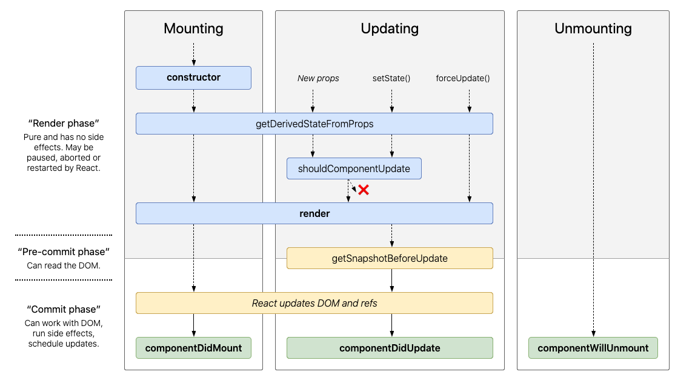

<div style="display: inline-block;">
<a class="link" href="http://oclipa.github.io/">&lt; home</a>
<a class="link" href="http://oclipa.github.io/toolbox.html">&lt; toolbox</a>
</div> 

## ReactJS

**Recommended Course:**
   * **[React - The Complete Guide (incl Hooks, React Router, Redux)](https://www.udemy.com/course/react-the-complete-guide-incl-redux/)**

-------------------------------------------------------------------------------------------------------

<button type="button" id="toggle-all" value="none">Expand All Sections</button>

-------------------------------------------------------------------------------------------------------

### Theory

<div id="howto">
<button type="button" class="collapsible">+ How To Approach Building An App In React</button>
<div class="content" style="display: none;" markdown="1">

**Based on: [https://reactjs.org/docs/thinking-in-react.html](https://reactjs.org/docs/thinking-in-react.html)**

1. Break data model into components that (ideally) only do one thing.
   * [Single Responsibility Principle](https://en.wikipedia.org/wiki/Single-responsibility_principle)
1. Break down UI into components, where each component matches one piece of the data model.
1. Arranage UI components into a hierarchy.
1. Build a static version of the hierarchy in React.
   * At this stage, use `props` rather than `state` (see "[What is the difference between state and props](https://reactjs.org/docs/faq-state.html#what-is-the-difference-between-state-and-props)").
   * Each component should only have a render() method (since it is static).
   * Generally, build bottom-up (i.e. low level of heirarchy first) and write tests as you build.
   * Data will be input as a `prop` into the top of the hierarchy, e.g. in index.js:
      * `ReactDOM.render(<App data="dataSource" />, document.getElementById('root'));`
1. Identify the minimum set of mutable (i.e. changeable) state required by the app.
   * [Don't Repeat Yourself Principle](https://en.wikipedia.org/wiki/Don%27t_repeat_yourself)
   * e.g. it is good for state to reference an array, but not the number of items in the array.
   * Three questions:
      * Is it passed in from a parent via props? If so, it probably isn’t state.
      * Does it remain unchanged over time? If so, it probably isn’t state.
      * Can you compute it based on any other state or props in your component? If so, it isn’t state.
1. Identify which component mutates, or owns, the state.
   * For each piece of state in your application:
      * Identify every component that renders something based on that state.
      * Find a common owner component (a single component above all the components that need the state in the hierarchy).
      * Either the common owner or another component higher up in the hierarchy should own the state.
      * If you can’t find a component where it makes sense to own the state, create a new component solely for holding the state and add it somewhere in the hierarchy above the common owner component.
   * The owner of the `state` will pass it to components that need it via `props`. 
   * Components that mutate state should avoid UI rendering.
1. Add inverse data flow (i.e. from lower hierarchy to higher).
   * Components should only update their own state.
   * Pass callbacks (e.g. `onChange` event) from higher components to lower components, which will fire when the state should be updated.  
   * The callbacks will call `setState()`.

</div>
</div>

<div id="design">
<button type="button" class="collapsible">+ React Design Principles</button>
<div class="content" style="display: none;" markdown="1">

**Based on: [https://reactjs.org/docs/design-principles.html](https://reactjs.org/docs/design-principles.html)**

1. The key feature of React is composition of components.
   * Components should be able to be changed without affecting the rest of the codebase.
   * Components describe any composable behaviour, which includes rendering, lifecycle and state.
1. Resist adding features that can be implemented by clients.
   * [Minimal API Surface Area](https://www.youtube.com/watch?v=4anAwXYqLG8)
   * Only add out-of-scope features if it will avoid clients producing multiple solutions to the same problem.
1. Before deprecating a feature, always consider all use cases and communicate reasons and alternatives to clients.
1. If some pattern is hard to express in a declarative way, provide an imperative API.
1. If you can't identify a perfect API, provide a temporary subpar API (but it must be temporary).
1. Value API stability.
   * When something changes, there should be a clear (and preferably automated) migration path.
   * Deprecate APIs internally first, before deprecating them for clients (to allow validation).
   * Add deprecation warnings in the current major version and change the behaviour in the following major release.
   * Consider using [codemod](https://www.youtube.com/watch?v=d0pOgY8__JM) scripts for changes that require a lot of repetitive manual work.
1. Value interoperability.
   * Enable gradual adoption by allowing existing functionality to be wrapped by new functionality.
1. Perform the minimum amount of work before returning to React.
   * Allows React to schedule and split work.
1. Be renderer-agnostic
   * Don't assume the app will only run in a browser.
   * e.g. [https://reactnative.dev](React Native)
1. Aim for elegant APIs but prefer ugly APIs if they avoid work for the client.
   * Correct, performant and a good developer experience are more important than elegant.
1. Prefer boring code to clever code.
   * Avoid new internal abstractions.
   * Verbose code is easier to move around and change.
1. Use verbose name for APIs.
   * Make points of interaction highly visible and distinct.
   * Optimize for search (makes automated updates easier).
1. [Eat Your Own Dog Food](https://en.wikipedia.org/wiki/Eating_your_own_dog_food)
   * But be open to the idea that external clients may have other use cases.

</div>
</div>

<div id="patterns">
<button type="button" class="collapsible">+ React Patterns</button>
<div class="content" style="display: none;" markdown="1">

There are many patterns that are considered important for React; certainly too many to list here.  

A good sources of information about React Patterns is:
   * [https://vasanthk.gitbooks.io/react-bits/](https://vasanthk.gitbooks.io/react-bits/)

Additional information can be found here:
   * [https://reactpatterns.com/](https://reactpatterns.com/)

Some examples of common patterns can be found here:
   * [https://github.com/reactjs/react-future/tree/master/07%20-%20Returning%20State](https://github.com/reactjs/react-future/tree/master/07%20-%20Returning%20State)

</div>
</div>

<div id="practices">
<button type="button" class="collapsible">+ Best Practices List (WIP)</button>   
<div class="content" style="display: none;" markdown="1">

**Taken from [https://medium.com/@konstankino/2019-reactjs-best-practices-design-patterns-516e1c3ca06a](https://medium.com/@konstankino/2019-reactjs-best-practices-design-patterns-516e1c3ca06a)**

* When using ReduxJS, split your Reducer code into smaller methods to avoid huge JSON within your Reducer.
* Consider using TypeScript in your apps if you do not do it already.
* Use the create-react-app generator to bootstrap your ReactJS app.
* Keep your code DRY. Don’t Repeat Yourself, but keep in mind code duplicate is NOT always a bad thing.
* Avoid having large classes, methods or components, including Reducers.
* Use more robust managers to manage application state, such as Redux.
* Use event synchronizer, such as Redux-Thunk, for interactions with your back end API.
* Avoid passing too many attributes or arguments. Limit yourself to five props that you pass into your component.
* Use ReactJS defaultProps and ReactJS propTypes.
* Use linter, break up lines that are too long.
* Keep your own jslint configuration file.
* Always use a dependency manager with a lock file, such as NPM or yarn.
* Test your commonly accessed code, code that is complex and prone to bugs.
* Write more tests that give more test coverage for your code with a little effort and test code to ensure its proper functioning.
* Every time you find a bug, make sure you write a test first.
* Use function-based components by starting to use React Hooks, a new ReactJS way to create state-full components.
* Use ES6 de-structuring for your props.
* Use conditional rendering.
* User `map()` to collect and render collections of components.
* Use partial components, such as `<>` … `</>`
* Name your event handlers with handle prefixes, such as `handleClick()` or `handleUpdate()`.
* Use `onChange` to control your inputs, such as `onChange={this.handleInputChange}`.
* Use JEST to test your ReactJS code.

</div>
</div>

------------------------------------------------------------------------------------------------------

### Practice

<div id="nodejs">
<button type="button" class="collapsible">+ Using NodeJS and create-react-app</button>
<div class="content" style="display: none;" markdown="1">

1. To install NodeJS:
   * Either, download the installer from the NodeJS website: [https://nodejs.org](https://nodejs.org)
   * Or, if using MacOS, install using HomeBrew: `brew install node`
   * Or, if using Zsh on Unbuntu (if using Bash, just replace `zsh` with `bash` and `.zshrc` with `.bash_profile`):
      1. `sudo apt-get update`
      1. `sudo apt-get upgrade`
      1. `sudo apt-get install build-essential`
      1. `curl -o- https://raw.githubusercontent.com/nvm-sh/nvm/v0.35.3/install.sh | zsh`
      1. Restart prompt (if there problems are reported with .bashrc, check the permissions on .bashrc)
      1. `nvm install --lts`
      1. `nvm use --lts`
      1. `echo "nvm use --silent --lts" >> .zshrc`
      
1. Install create-react-app (might not need `sudo`): 
   * `[sudo] npm install create-react-app -g`
1. Create a new app: 
   * `create-react-app [app-name] [--scripts-version version]`
   * This will create a new sub-directory of the current directory called `app-name`.
   * `--scripts-version version` is optional; if not used, the latest version of create-react-app will be used.
1. Install an existing app (which has an existing package.json file): 
   * In the app root folder run: `npm install`
1. In the new app directory, start the development server: 
   * `npm start`
   * This actually calls a bespoke command defined in package.json.

</div>
</div>

<div id="simple-app">  
<button type="button" class="collapsible">+ Example of a Simple App</button> 
<div class="content" style="display: none;" markdown="1">

### index.js 

**(boiler-plate code generated by create-react-app)**

```jsx
import React from 'react';
import ReactDOM from 'react-dom';
import './index.css';
import App from './App';
import * as serviceWorker from './serviceWorker';

ReactDOM.render(
  <React.StrictMode>
    <App />
  </React.StrictMode>,
  document.getElementById('root')
);

// If you want your app to work offline and load faster, you can change
// unregister() to register() below. Note this comes with some pitfalls.
// Learn more about service workers: https://bit.ly/CRA-PWA
serviceWorker.unregister();

```

### App.js 

**(created from template generated by create-react-app)**

```jsx
// imports ////////////////////////////////////////////////////

import React, { Component } from 'react';
import ReactDOM from 'react-dom';
import './App.css';
import Calculator from './Calculator/Calculator.js';

// App class //////////////////////////////////////////////////

class App extends Component {
  
  // application state ////////////////////////////////////////

  state = {
    algName: 'None',
    val1: 0,
    val2: 0
  };
  
  // event handlers and functions /////////////////////////////

  val1ChangedHandler = ( event ) => {
    this.setState( 
        {
          algName: "None",
          val1: event.target.value
        } 
      );
  };

  val2ChangedHandler = ( event ) => {
    this.setState( 
        {
          algName: "None",
          val2: event.target.value
        } 
      );
  };
  
  doCalculationHandler = ( event ) => {
    this.setState( 
        {
          algName: event.target.value
        } 
      );
  };

  // render ////////////////////////////////////////////////////

  render() {
    // local style /////////////////////////////////////////////
    const style = {
      backgroundColor: 'green',
      color: 'white',
      font: 'inherit',
      border: '1px solid blue',
      padding: '8px',
      cursor: 'pointer'
    };
    
    let a = this.state.algName;
    let v1 = this.state.val1;
    let v2 = this.state.val2;

    let calc = (<Calculator algName={a} val1={v1} val2={v2} />);

    return (
      <div className="App"> {/* required */} 
        <div className="inputs">
            <input type="text" 
                    onChange={(event) => 
                                this.val1ChangedHandler(event)} 
                    value={v1} />
            
            <input type="text" 
                    onChange={(event) => 
                                this.val2ChangedHandler(event)} 
                    value={v2} />
            
            <div className = "buttons">
              <button style={style} 
                      onClick={(event) => 
                                this.doCalculationHandler(event)}
                      value="add">Add</button>
              <button style={style} 
                      onClick={(event) => 
                                this.doCalculationHandler(event)}
                      value="subtract">Subtract</button>
            </div>
        </div>
        <div className="output">
          {calc}
        </div>
      </div>
    );
  }
}

export default App;
```

### Calculator/Calculator.js

**(created manually)**

```jsx
import React from 'react';
import './Calculator.css';

const calculator = (props) => {
    
    const algName = props.algName;
    const val1 = parseFloat(props.val1);
    const val2 = parseFloat(props.val2);
    
    let result = 0;
    
    if (algName === 'add') {
      result = val1 + val2;
    }
    else if (algName === 'subtract') {
      result = val1 - val2;
    }
    else if (algName === 'None') {
      return <span></span>
    }
    
    return (
        <span>Result = {result}</span>
    )
};

export default calculator;
```
</div>
</div>

<div id="dom">
<button type="button" class="collapsible">+ Virtual DOM</button>   
<div class="content" style="display: none;" markdown="1">

It is important to note that, when render() is called for an app (or a functional component returns), React creates a Virtual DOM ([Domain Object Model](https://www.w3schools.com/whatis/whatis_htmldom.asp)); it does not automatically update the real DOM (i.e. the UI).  This is for performance reasons (updating the real DOM is potentially expensive).

Once generated, the new Virtual DOM is compared to the previous Virtual DOM to see if anything has changed.  In the event something has changed, the real DOM is updated with the changes in the new Virtual DOM, and the UI redrawn.  If nothing has changed, the UI is not updated.
</div>
</div>
  
<div id="components">
<button type="button" class="collapsible">+ Functional vs Class Components</button>   
<div class="content" style="display: none;" markdown="1">

**Both Functional and Class components should start with an uppercase letter.**

Class components should be used if the component is stateful, or there is a need to use lifecycle methods (e.g. `componentDidMount()`).

&nbsp;

-------------------------------------------------------------------------------------------------------

### Functional Component

```jsx
// ES5
function Welcome(props) {
  return <h1>Hello, {props.name}</h1>;
}

// ES6
const Welcome = (props) => {
  return <h1>Hello, {props.name}</h1>;
}
```

&nbsp;

* Functional components do not access props via `this`(e.g. `props.XY`).

Pros:

* Functional components are generally considered easier to read and test.
* Code tends to be smaller.
* It is easier to separate container and presentational components.
* There may be a performance boost in future React versions.

Cons:

* You cannot call setState() in a functional component.
   * As of React 16.8, you can use useState() but this only allows you to overwrite the state, rather than merging updates into the existing state.
* You cannot use lifecycle hooks in a functional component.
   * As of React 16.8, you can use useEffect() however this is not as fine-grained as lifecycle hooks.
   * useEffect() allows you to perform an action after render() has been called.

&nbsp;

-------------------------------------------------------------------------------------------------------

**useEffect()**

* `import React, {useEffect} from 'react';`
* Takes a function that will run for every render cycle.
  * `useEffect( () => { somefunction; }); )`
* Can have multiple calls to useEffect in the same function (e.g. each reacting to different object).
* Essentially, componentDidMount and componentDidUpdate combined in one effect (see below).
* Controlled by passing an object (or array of objects) into the method and the method only reacts if the object has changed:
  * `useEffect( () => { somefunction; }, [props.somedata] ); )`
  * To have the method run only the first time an object is rendered, pass an empty array.
* To perform clean-up using useEffect, return a function:
  * `useEffect( () => { somefunction; return () => { cleanupfunction }; }, [props.somedata] );`
  * Runs BEFORE the main useEffect function runs, but AFTER the (first) render cycle.
  * If an empty array is passed, the cleanup function will only run when the component is unmounted (destroyed).

&nbsp;

-------------------------------------------------------------------------------------------------------

### Class Component

```jsx
class Welcome extends React.Component {
  render() {
    return <h1>Hello, {this.props.name}</h1>;
  }
} 
```

* Class components must access state and props using `this`(e.g. `this.state.XY`).

* As a general of thumb, class components are preferred if you need fine-grained control of state, or you need actions performed outside of render() and you do not want to use React Hooks.

&nbsp;

-------------------------------------------------------------------------------------------------------

**Class Component LifeCycle**

1. This is only available to Class components.
1. Lifecycle Hooks have nothing to do with React Hooks!

<a href="assets/reactjs-component-lifecycle.png" target="_blank" style="width: 80%"></a>

<br/>[Original Image](https://twitter.com/dan_abramov/status/981712092611989509/photo/1)
&copy; Dan Abramov: [https://overreacted.io/](https://overreacted.io/)
<br/>[Interactive Version](http://projects.wojtekmaj.pl/react-lifecycle-methods-diagram/)

* **Mounting**
   1. `constructor()`
      * Call super(props)
      * Use to set up state
      * Don't cause Side-Effects
   1. `getDerivedStateFromProps(props, state)`
      * Sync state with props
      * Very niche case
      * Don't cause Side-Effects
   1. `render()`
      * Prepare and Structure your JSX code
      * Don't do any actions that will block the rendering process.
      * Only completes after render() has been called for all children.
   1. `componentDidMount()` &lt;-- Commonly used
      * Very common 
      * Can cause Side-Effects (e.g. send http requests)
      * Don't update state (at least, not synchronously)
   1. `componentWillMount()`
      * Available but deprecated
      * Do not use

* **Updating**
   1. `getDerivedStateFromProps(props, state)`
      * See above
   1. `componentWillReceiveProps(props)`
      * Available but deprecated
      * Do not use
   1. `shouldComponentUpdate(nextProps, nextState)` &lt;-- Commonly used
      * Used to cancel update process (even if Virtual DOM changes)
      * Typically used for performance reasons, but needs to be used sparingly.
      * e.g. `return nextProps.property !== this.props.property`
      * For a functional equivalent to this, see [React.memo()](https://reactjs.org/docs/react-api.html#reactmemo).
   1. `render()`
      * See above
   1. `getSnapshotBeforeUpdate(prevProps, prevState)`
      * Another niche method
      * Last minute DOM operations (e.g. getting current scrolling position of user)
      * Don't cause Side-Effects
   1. `componentWillUpdate()`
      * Available but deprecated
      * Do not use
   1. `componentDidUpdate()` &lt;-- Commonly used
      * Can cause Side-Effects (e.g. send http requests)
      * Don't update state (at least, not synchronously)

* **Unmounting (clean-up)**
   * `componentWillUnmount()`
   
* **Other**
   * `componentDidCatch()`

</div>
</div>

<div id="pure">
<button type="button" class="collapsible">+ PureComponents</button>   
<div class="content" style="display: none;" markdown="1">

* A [`PureComponent`](https://reactjs.org/docs/react-api.html#reactpurecomponent) is essentially the same as a `Component` except that it checks to see if either the props or state has changed before allowing the Virtual DOM to be updated. 
   * i.e. This is a replacement for `shouldComponentUpdate()` (which will ignored for a `PureComponent`).
   * Note that all children must extend `PureComponent`.

```jsx
import React, { PureComponent } from 'react';

class App extends PureComponent {
  
  ...
  
  render() {
    ...
  };
}
```
</div>
</div>

<div id="adjacent">
<button type="button" class="collapsible">+ Adjacent Elements</button>   
<div class="content" style="display: none;" markdown="1">

The `render()` method does not allow adjacent elements (i.e. ones with the same root) to be returned, e.g.

```jsx
return (
    <p onClick={
      this.props.click
    }>
      I'm {this.props.name} and 
      I am {this.props.age} years old!
    </p>
    <p>{this.props.children}</p>
    <input 
      type="text" 
      onChange={this.props.changed} 
      value={this.props.name} 
    />
)
```
There are several ways around this:

&nbsp;

-------------------------------------------------------------------------------------------------------

* Using a root element that wraps all other elements:

```jsx
return (
    <div>
      <p onClick={
        this.props.click
      }>
        I'm {this.props.name} and 
        I am {this.props.age} years old!
      </p>
      <p>{this.props.children}</p>
      <input 
        type="text" 
        onChange={this.props.changed} 
        value={this.props.name} 
      />
    </div>
)
```

&nbsp;

-------------------------------------------------------------------------------------------------------

* Using square brackets (so that an array is being returned), however the elements being returned need to be delimited by commas.  Also, a `key` needs to be specified for each element:

```jsx
return (
    [
      <p key="i1" onClick={
        this.props.click
      }>
        I'm {this.props.name} and 
        I am {this.props.age} years old!
      </p>
      <p key="i2">{this.props.children}</p>
      <input
        key="i3"
        type="text" 
        onChange={this.props.changed} 
        value={this.props.name} 
      />
    ]
)
```

&nbsp;

-------------------------------------------------------------------------------------------------------

* Using an Wrapper function that wraps all other elements.
   * Caveat: In some places this function is referred to as `Aux`, however this is a reserved word on Windows and should be avoided (unless you can guarantee that Windows will never be used for development).

*Wrapper.js*

```jsx
import React from 'react';

const wrapper = props => props.children;

export default wrapper;
```

*Person.js*

```jsx
import Wrapper from '../../../hoc/Wrapper';

...

render() {
  return (
      <Wrapper>
        <p onClick={
          this.props.click
        }>
          I'm {this.props.name} and 
          I am {this.props.age} years old!
        </p>
        <p>{this.props.children}</p>
        <input 
          type="text" 
          onChange={this.props.changed} 
          value={this.props.name} 
        />
      </Wrapper>
  );
}
```

&nbsp;

-------------------------------------------------------------------------------------------------------

* Using React.Fragment:

Since React 16.8, there is a built-in version of `Wrapper` called `React.Fragment`:

*Person.js*

```jsx
import React, { Component, Fragment } 
        from 'react';
...

render() {
  return (
      <Fragment>
        <p onClick={
          this.props.click
        }>
          I'm {this.props.name} and 
          I am {this.props.age} years old!
        </p>
        <p>{this.props.children}</p>
        <input 
          type="text" 
          onChange={this.props.changed} 
          value={this.props.name} 
        />
      </Fragment>
  );
}
```
</div>
</div>

<div id="hoc">
<button type="button" class="collapsible">+ Higher Order Components (HOC)</button>   
<div class="content" style="display: none;" markdown="1">

The `Wrapper`and `Fragment` components are examples of Higher Order Components.  This means that they wrap another component and add specific, limited functionality to the wrapped component.

There is a general convention to name HOCs with a `With` at the beginning, and place them in an `hoc` folder.

There are two approaches to defining HOCs:

&nbsp;

-------------------------------------------------------------------------------------------------------

* Return a jsx functional component.
   * This approach is recommended when changing the HTML code or styling.

*hoc/WithClass.js (upper-case 'W' to indicate this is a component, not function)*

```jsx
import React from 'react';

const withClass = props => (
  <div className={props.classes}>
    {props.children}
  </div>
);

export default withClass;

```

*containers/App.js*

```jsx
class App extends Component {
  import React from 'react';

  // upper-case 'W' to indicate this 
  // is a component, not a function
  import WithClass from '../hoc/WithClass';
  
  ...
 
  render() {
    return (
      <WithClass classes={styles.App}>
        ...
      </WithClass>
    );
  } 
}

export default App;
```

&nbsp;

-------------------------------------------------------------------------------------------------------

* Return a javascript function that returns a jsx functional component:
  * This approach is recommended for adding behind-the-scenes logic, e.g. error handling or sending analytic data.

*hoc/withClass.js (lower-case 'w' to indicate this is a function, not component)*

```jsx
import React from 'react';

const withClass = 
  (WrappedComponent, className) => {
    return props => (
      <div className={className}>
        <WrappedComponent {...props} />}
      </div>
  );
};

export default withClass;

```
*containers/App.js*

```jsx
class App extends Component {
  import React from 'react';
  
  // lower-case 'w' to indicate this 
  // is a function, not component
  import withClass from '../hoc/WithClass';
  import Wrapper from '../hoc/Wrapper';
  
  ...
 
  render() {
    return (
      <Wrapper>
        ...
      </Wrapper>
    );
  } 
}

export default withClass(App, styles.App);
```

</div>
</div>

<div id="state">
<button type="button" class="collapsible">+ Props & State</button>   
<div class="content" style="display: none;" markdown="1">

There are two approaches to handling application state:
   * `state`
   * `props`

&nbsp;

-------------------------------------------------------------------------------------------------------

**state**

* `state`, as the name suggests, records the current state of a **class** component.
* Not all components need to have state (it can be maintained by a parent component).
* The `state` object is defined at the top of the class definition:

```jsx
import React, { Component } from 'react';
import Town from 'Town';

class App extends Component {
  state = {
    persons: [
      { name: 'Fred', age: 40 },
      { name: 'Wilma', age: 35 },
      { name: 'Barney', age: 38 },
    ],
    location: 'Bedrock'
  };
  
  ...
  
  render() {
    return (
      <Town
        name={this.state.location}
        persons={this.state.persons}
        clicked={this.deleteOldestHandler}
      />
    );
  }
}
```

&nbsp;

* In class components, state should be updated using the [`setState()`](https://reactjs.org/docs/react-component.html#setstate) function; it should never be updated directly (e.g. do not use `this.state.name = newName`).
* Be aware that `setState()` is [asynchronous](https://medium.com/@wereHamster/beware-react-setstate-is-asynchronous-ce87ef1a9cf3).  Calling `setState()` should be considered a request that React may ignore.  This is particularly true if `setState()` is called multiple times in the same update cycle; later calls may overwrite earlier ones. 
* In addition, it is good practice to only ever change state properties immutably.  This can be achieved by making a copy of the property to be updated, updating the copy and then overwriting the original property, e.g.

Bearing these issues in mind, the recommended pattern is the following:

```jsx
deleteOldestHandler = () => {
  // create a copy of the person array
  // using the spread operator
  const persons = [...this.state.persons];

  // sort the array by increasing age and 
  // remove the last person
  persons.sort((a, b) => a.age - b.age).pop();
  
  // overwrite the old array with the new one.
  // also update a counter of number of people 
  // deleted.
  // prevState is guaranteed to be the latest
  // state.
  this.setState((prevState, props) => { 
    return {
      persons: persons, 
      deleteCounter: prevState.deleteCounter + 1
    };
  });
}
```

&nbsp;

-------------------------------------------------------------------------------------------------------

**props**

* Unlike `state`, both Class components and Functional components can access the `props` object.
   * For Class components, this is done use the `this` keyword: `persons = this.props.persons;`.
   * For Functional components, the `props` object is passed in as a function parameter: `const Town = (props) => { persons = props.persons; }`
* The `props` object is read-only.  It is created from the tag parameters for the component: `<Town persons={persons} />`.
* Since props cannot be updated, the only way to update the state is via callbacks passed via the `props` object.  In this way, the parent object both owns the state and is responsible for updating it.

```jsx
import React from 'react';

const Town = (props) => { 
  return (
    <div>
      <h1>Name: {props.name}</h1>
      <h1>Occupants: {props.persons.length}</h1>
      <button onClick={props.clicked}>
        Remove Oldest Person
      </button>
    </div>
  );
}

export default Town;
```

&nbsp;

-------------------------------------------------------------------------------------------------------

**useState()**

* The one important caveat to the above is that, since React 16.8, functional components can call `useState()` to update the state.
* This method only allow the entire state to be overwritten; it does not allow specific properties to be updated.
* However, can have multiple calls to `useState` in the same functional class.
* `useState` returns an array with exactly two elements.
   * The first element is the current state.
   * The second element will always be a function that allows the state to be updated.

```jsx
import React, { useState } from 'react';

const App = props => {
  const [pState, setPState] = useState({
    persons: [
      { name: 'Fred', age: 40 },
      { name: 'Wilma', age: 35 },
      { name: 'Barney', age: 38 },
    ]  
  });
  
  // add location separately
  const [lState, setLState] 
          = useState(
              {
                location: 'Bedrock'
              }
            );
  
  // add some other random object
  useState('another value');

  // function within a function
  const nameHandler = () => {
    setPState({
      persons: [
        { name: 'Betty', age: 34 },
        { name: 'Wilma', age: 35 },
        { name: 'Barney', age: 38 },
      ]
    });
  }
  
  setLState(
    {location: 'Granitetown'}
  );
  
  return (
    <div>
      <h1>
        Hi {pState.persons[0].name}
      </h1>
      <button onClick={nameHandler}>
        Switch Name
      </button>
    </div>
  )
}
```
</div>
</div>

<div id="proptypes">
<button type="button" class="collapsible">+ PropTypes</button>   
<div class="content" style="display: none;" markdown="1">

PropTypes allow control of the data types used in the app (i.e. more like a strongly-typed language).  This is a feature provided by React, but it is not included in React Core, so it needs to be installed:

* Install: `npm install prop-types`
* Import: `import PropTypes from 'prop-types';`

PropTypes can be used on both class and functional components.  They are particularly important when you are sharing components with other people.

```jsx
import React, { Component } from 'react';
import PropTypes from 'prop-types';

class Person extends Component {
  render() {
    return (
      <Wrapper>
        <p onClick={this.props.click}>
          I'm {this.props.name} and I 
          am {this.props.age} years old!
        </p>
        <p>{this.props.children}</p>
        <input 
          type="text" 
          onChange={this.props.changed} 
          value={this.props.name} 
        />
      </Wrapper>
    ); 
  }
};

// specify prop values types after 
// component has been defined
Person.propTypes = {
  click: PropTypes.func,
  name: PropTypes.string,
  age: PropTypes.number,
  changed: PropTypes.func
};

export default withClass(Person, styles.Person);
```
</div>
</div>

<div id="refs">
<button type="button" class="collapsible">+ Refs</button>   
<div class="content" style="display: none;" markdown="1">

Refs (i.e. references) are used to accessing specific elements of the DOM.  Specifically, there are used for accessing HTML elements or class components (they cannot be used to reference functional components, although functional components can use refs via React Hooks - see below).

In the following example, a ref is added to the input element.  The ref points to a function that creates a new class property that points to the input element.

The property is the used to ensure that, when the Person components are mounted, the text field for the last Person mounted will be given the focus.

In older code, an example implementation might be:

```jsx
import React, { Component } from 'react';
import PropTypes from 'prop-types';

class Person extends Component {
  constructor() {
    this.inputElement = React.createRef();
  }
  
  componentDidMount() {
    this.myInputElement.focus();
  }
  
  render() {
    return (
      <Wrapper>
        ...
        
        <input 
          ref={
            (el) => {
              this.myInputElement = el
             };
          };
          type="text" 
          onChange={this.props.changed} 
          value={this.props.name} 
        />
      </Wrapper>
    ); 
  }
};
```

In newer code, an alternative approach is to create a generic ref in the constructor and then attach this to the current element of interest:

```jsx
import React, { Component } from 'react';
import PropTypes from 'prop-types';

class Person extends Component {
  constructor(props) {
    super(props);
    this.elementRef = React.createRef();
  }
  
  componentDidMount() {
    // current gives access to the 
    // current reference
    this.elementRef.current.focus();
  }
  
  render() {
    return (
      <Wrapper>
        ...
        
        <input 
          ref={this.elementRef}
          type="text" 
          onChange={this.props.changed} 
          value={this.props.name} 
        />
      </Wrapper>
    ); 
  }
};
```

&nbsp;

-------------------------------------------------------------------------------------------------------

**Refs and Functional Components - useRef()**

As mentioned above, you cannot use refs to refer to functional components, but they can be used inside functional components by using React Hooks, specifically `useRef()`.

The basic pattern is:
1. Create ref to null before the `return` method: `const myBtnRef = useRef(null);`
1. Add the ref to the element of interest: `<button ref={myBtnRef} onClick={props.clicked}>`
1. Call the ref using the `useEffect()` hook: `useEffect(() => { myBtnRef.current.click(); }, []);`

The reason the ref must be called from `useEffect()` is that it cannot be called before the functional component has returned (since the elements of the component must be initialized).  

Since `useEffect()` is only called after the `return` method, this makes it an appropriate place to access the ref.

```jsx
import React, { useEffect, useRef } 
        from 'react';

const Cockpit = (props) => {
  const toggleBtnRef = useRef(null);

  // runs after first render cycle
  useEffect(() => {
  
    toggleBtnRef.current.click();
    
  }, []);

  ...

  return (
    <div>
      <button 
        ref={toggleBtnRef} 
        onClick={props.clicked}
      >
        Toggle Persons
      </button>
    </div>
  );
};
```

&nbsp;

-------------------------------------------------------------------------------------------------------

For further information, see here:
   * [https://reactjs.org/docs/refs-and-the-dom.html](https://reactjs.org/docs/refs-and-the-dom.html)

</div>
</div>

<div id="context">
<button type="button" class="collapsible">+ Context API</button>   
<div class="content" style="display: none;" markdown="1">

The Context API is used to pass state between objects when intervening objects have no interest in the state (e.g. passing a property to a great-grandchild).

First we create a globally available javascript object, e.g.:

*context/auth-context.js*

```jsx
import Read from 'react';

const authContext = React.createContext({
  auth: false, 
  login: () => {}
});

export default authContext;
```

Then, in the parent component, the components (or parents of the components) that need to receive the context are wrapped in a `<AuthContext.Provider />` tag,  in the `render()` method:

*App.js*

```jsx
import AuthContext 
        from 'context/auth-context';

class App extends Component {
  constructor(props) {
    super(props);
    
    this.state = {
      persons: [
        { id: 'asfa1', name: 'Max' },
        { id: 'vasdf1', name: 'Manu' },
        { id: 'asdf11', name: 'Stephanie' }
      ],
      auth: false
    }
  }

  loginHandler = () => {
    this.setState( { auth: true } );
  };

  render() {
  
    persons = (
      <Persons 
        persons={this.state.persons}
        isAuthenticated={this.state.auth}
      />
    );
  
    return (
      <Wrapper>
        { /* components not interested in 
             context go outside tags */ }

        <AuthContext.Provider 
          value={ 
            {
              authenticated: this.state.auth, 
              login: this.loginHandler
            } 
          } 
        >
         { /* components interested in 
              context go between tags */ }
         
         <Cockpit />
         {persons}

        </AuthContext.Provider>
      </Wrapper>
    );
  }
}

```

And finally, in the components that need to access the context, the relevant elements in the `render()` method are wrapped in a `<AuthContext.Consumer />` tag:

*Person.js (inherits context from Persons.js)*

```jsx
import AuthContext 
        from 'context/auth-context';

class Person extends Component {

  render() {
    return (
      <Wrapper>
        <AuthContext.Consumer>
          {(context) => {
              context.auth ? 
                <p>Authenticated!</p> : 
                <p>Please log in</p>
            }
          }
        </AuthContext.Consumer> 
        
        <p>{this.props.children}</p>
      </Wrapper>
    );
  }
}

```

*Cockpit.js*

```jsx
import AuthContext from 'context/auth-context';

const Cockpit = (props) => {

  render() {
    return (
      <Wrapper>
        <h1>{props.title}</h1>
      
        <AuthContext.Consumer>
          {(context) => {
              <button onClick={context.login}>
                Log in
              </button>
            }
          }
        </AuthContext.Consumer>
      </Wrapper>
    );
  }
}

```

&nbsp;

-------------------------------------------------------------------------------------------------------

**contextType (class components only)**

For class components, a more elegant approach, which also allows the context to be accessed outside of the `render()` method, can be used.

By creating a static reference to the context called `contextType` this makes the context accessible anywhere within the class using `this.context`.

*Person.js*

```jsx
import AuthContext 
        from 'context/auth-context';

class Person extends Component {

  static contextType = AuthContext;
  
  componentDidMount() {
    console.log(this.context.auth);
    console.log(this.context.login);
  }
  
  render() {
    return (
      <Wrapper>
        {
          this.context.auth ? 
            <p>Authenticated!</p> : 
            <p>Please log in</p>
        }
        
        <p>{this.props.children}</p>
      </Wrapper>
    );
  }
```


&nbsp;

-------------------------------------------------------------------------------------------------------

**useContext() (functional components only)**

For functional components, there is a React Hook that can be used: `useContext()`. 

By creating a const reference to the context, `useContext()` makes the context accessible anywhere within the function..

*Cockpit.js*

```jsx
import React, { useContext } from 'react';
import AuthContext 
        from 'context/auth-context';

const Cockpit = (props) => {

  const authContext = useContext(AuthContext);

  console.log(authContext.auth);

  render() {
    return (
      <Wrapper>
        <h1>{props.title}</h1>
      
        <button onClick={authContext.login}>
          Log in
        </button>
      </Wrapper>
    );
  }
}

```

&nbsp;

-------------------------------------------------------------------------------------------------------

For further information, see here:
   * [https://reactjs.org/docs/context.html](https://reactjs.org/docs/context.html)

</div>
</div>

<div id="lists">
<button type="button" class="collapsible">+ Lists in JSX</button>   
<div class="content" style="display: none;" markdown="1">

List items must always have a `key` property.  Note that using `index` as the `key` is not recommended, since it is an intrinsic part of the list, rather than part of the objects in the list.

```jsx
deleteHandler = (personIndex) => {
  // create copy of array 
  // before manipulating it.
  const persons = [...this.state.persons];
  persons.splice(personIndex, 1);
  this.setState({persons: persons});
}

render() {
  // create list of persons using map()
  return this.state.persons.map(
    (person, index) => {
      return <Person 
        click={() => this.deleteHandler(index)}
        name={person.name} 
        age={person.age}
        key={person.id} />
    }
  );
}
```

</div>
</div>

<div id="conditionals">
<button type="button" class="collapsible">+ Using Conditionals In JSX</button>   
<div class="content" style="display: none;" markdown="1">

* Conditional statements take advantage of the fact that you can inject javascript into jsx using single curly braces `{}`.
* Having said that, inside jsx, only ternary expressions are available (`test ? a : b`).

```jsx
import React, { Component } from 'react';
import Town from 'Town';

class App extends Component {
  togglePersonsHandler = () => {
    const doesShow = this.state.showPersons;
    this.setState({showPersons: !doesShow});
  }

  render() {
    return (
      <div>
        { this.state.showPersons ? 
          <div>
            ...
          </div> : null
        }
      </div>
    );
  };
}
```

&nbsp;

* Alternatively, the following is a more elegant (and recommended) approach:

```jsx
import React, { Component } from 'react';
import Town from 'Town';

class App extends Component {
  togglePersonsHandler = () => {
    const doesShow = this.state.showPersons;
    this.setState({showPersons: !doesShow});
  }

  render() {
    let persons = null;
    
    if (this.state.showPersons) {
      persons = (
          <div>
            ...
          </div> 
      )
    }
    
    return (
      <div>
        {persons}
      </div>
    );
  };
}
```

</div>
</div>

<div id="events">
<button type="button" class="collapsible">+ Events &amp; Binding</button>   
<div class="content" style="display: none;" markdown="1">

**Event Handlers**

The following is an example of a basic implementation of an event handler:

```jsx
class App extends Component {

  // naming convention: 
  // [verb] + [noun] + "Handler"
  // ([noun] + [verb] + "Handler")
  switchNameHandler = () => {
    console.log('Was clicked!');
  }
  
  render() {
    return (
      <button 
        onClick={this.switchNameHandler}>
          Switch Name
      </button>
    );
  }
}
```
Note that we only register a reference to the event handler (`this.switchNameHandler`) with the event, rather than registering it as a method (`this.switchNameHandler()`).  If it were registered as a method, it would be invoked immediately upon registration (due to the `()`), rather than waiting until the event is triggered.

If you need to pass the event handler to a child component (which is a common use case), the handler is registered as a property of the child component:

```jsx
  render() {
    return (
      <Person 
        name={this.state.persons[1].name} 
        age={this.state.persons[1].age} 
        click={this.switchNameHandler} />
    );
  }
```
If you need to pass a value to the event handler, there are two approaches:
   * The `bind()` method.
   * An anonymous function.

&nbsp;

-------------------------------------------------------------------------------------------------------

**`bind()` method**

By calling the `bind()` method on the handler, a value can be passed as an argument.

```jsx
switchNameHandler = (newName) => {
  this.setState( {
    persons: [
      { name: 'Fred', age: 40 },
      { name: newName, age: 35 },
      { name: 'Barney', age: 38 },
    ],
  } );
}

render() {
  return (
    <button 
      onClick={
        this.switchNameHandler.bind(
          this, 'Betty'
        )
      }>Switch Name</button>
  );
}
```

&nbsp;

-------------------------------------------------------------------------------------------------------

**Anonymous function**

```jsx
render() {
  return (
    <button 
      onClick={
        () => this.switchNameHandler('Betty')
      }>Switch Name</button>
  );
}
```
Note that in this case `()` must be added to the event handler, since we are registering a reference to the anonymous function, rather than the event handler itself.  This means that we can pass data to the event handler. 

&nbsp;

-------------------------------------------------------------------------------------------------------

Of the two approaches, **the `bind()` method is generally the most efficient**, so it is recommended to use this rather than the anonymous function.

&nbsp;

-------------------------------------------------------------------------------------------------------

**Two-Way Binding**

Two-way binding means that when something in the browser changes something in the data store, that change is immediately reflected in the browser.

To achieve this, in addition to passing an event handler to the child, which allows the child to trigger an update of the state, the child also receives the updated state via `props`.

In the following example, the sequence of actions is:

1. `App` renders `Person` while passing it the `state` (via `props`) and a `nameChangedHandler` event handler. 
1. `Person` renders `props.name` and registers the `nameChangedHandler` event handler with the `onChange` event for the `<input>`field.
1. The `<input>` field in `Person` is updated by the user, triggering the `onChange` event.
1. The `nameChangedHandler` receives the updated element (i.e. `<input>`) via `event.target`, and updates the `state` with the value of `value`.
1. `App` then renders `Person` again, passing it the updated `state`.
1. `Person` renders the updated `props.name`.
1. And the cycle repeats...

*App.js*

```jsx
class App extends Component {

  nameChangedHandler = (event) => {
    this.setState( {
      persons: [
        { name: 'Fred', age: 40 },
        { name: event.target.value, age: 35 },
        { name: 'Barney', age: 38 },
      ],
    } );
  }
  
  render() {
    return (
      <Person 
        name={this.state.persons[1].name} 
        age={this.state.persons[1].age} 
        click={this.switchNameHandler}
        changed={this.nameChangedHandler} />
    );
  } 
}
```
*Person.js*

```jsx
const person = (props) => {
  return (
    <div>
      <p>{props.name}</p>
      <input 
        type="text" 
        onChange={props.changed} 
        value={props.name}/>
    </div>
  )
};
```
</div>
</div>

<div id="css">
<button type="button" class="collapsible">+ Styling</button>   
<div class="content" style="display: none;" markdown="1">

There are several approaches to styling React pages:
   * Inline
   * Stylesheets
   * Dynamic
   * Radium
   * styled-components
   * CSS modules

&nbsp;

-------------------------------------------------------------------------------------------------------

**Inline**

This means that the styles are added to tags in the `render()` method using the inline `style` property.  In this case, the styles are scoped to the component.

```jsx
class App extends Component {
  render() {
    const style = {
      backgroundColor: '#fff',
      width: '60%',
      border: '1px solid #eee',
      boxShadow: '0 px 3px #ccc',
      cursor: 'pointer'
    };
    
    return (
      <div style={style}>
        ...
      </div> 
    );
  } 
}
```
Note that there are 3 differences between this approach and standard CSS syntax:
   * Hypenated names are not supported, so `background-color`becomes `backgroundColor`. 
   * Properties are separated by commas, rather than semi-colons.
   * Property values are enclosed in single quotes.

Some CSS features are quite difficult to implement using this approach (e.g. `:hover`).

&nbsp;

-------------------------------------------------------------------------------------------------------

**Stylesheets**

There are two important things to be aware of when using an imported stylesheet in React:
   * CSS class names for tags are identified using `className` not `class` (because "html" in React is actually JSX, where `class` already has a different meaning).
   * Imported CSS is globally scoped, so implementing a style for `button`, for example, will affect every button in the app. 

*Person.css*

```css
.Person {
  background-color: #fff;
  width: 60%;
  border: 1px solid #eee;
  box-shadow: 0 px 3px #ccc;
  cursor: pointer;
}
```
*Person.js*

```jsx
import './Person.css';

const person = (props) => {
  return (
    <div className="Person">
      ...
    </div>
  )
};
```

&nbsp;

-------------------------------------------------------------------------------------------------------

**Dynamic**

Dynamic-styling essentially means using JSX features to replace the style identifiers with variables that can be generated on the fly.

*App.css*

```css
.App {
  text-align: center;
}

.red {
  color: red;
}

.bold {
  font-weight: bold;
}
```
*App.js*

```jsx
class App extends Component {
  render() {
    const style = {
      backgroundColor: '#fff'
    };
    
    // dynamically change backgroundColor
    if (this.state.showPersons) {
      style.backgroundColor: 'green';
    }
    
    // dynamically change text
    const classes = [];
    if (this.state.persons.length <= 2) {
      classes.push('red'); // ['red']
    }
    if (this.state.persons.length <= 1) {
      classes.push('bold'); // ['red', 'bold']
    }
    
    return (
      <div className={classes.join(' ')}>
        <button style={style}>Click Me!</button>
        ...
      </div> 
    );
  } 
}
```

&nbsp;

-------------------------------------------------------------------------------------------------------

**Radium**

Radium allows inline styles to be used with pseudo-selectors and media queries. It is an example of a Higher Order Component.

* Install: `npm install radium;`
* Import: `import Radium from 'radium';`

To use Radium, wrap the component with Radium when exporting:

`export default Radium(App);`

And wrap the entire App with `<StyleRoot>` tags:

*App.js*

```jsx
import Radium, { StyleRoot } from 'radium';

class App extends Component {
  render() {
    return (
      <StyleRoot>
        <div>
          <Person />
          <Person />
          <Person />
        </div>
      </StyleRoot>
    )
  }
}
```
*Person.js*

```jsx
import Radium from 'radium';

const person = (props) => {
  const style= {
    backgroundColor: 'green',
    color: 'white',
    cursor: 'pointer',
    
    // support for :hover and 
    // @media enabled by Radium
    
    ':hover': {       
      backgroundColor: 'lightgreen'
      color: 'black'
    },
    '@media (min-width: 500px)': {
      width: '450px';
    }
  };
  
  if (props.showPersons) {
    style[':hover'] = {
      backgroundColor: 'salmon'
      color: 'black'
    };
  }
  
  return (
    <div style={style}>
      ...
    </div>
  )
};

export default Radium(Person);
```

&nbsp;

-------------------------------------------------------------------------------------------------------

**styled-components**

See: [https://styled-components.com/](https://styled-components.com/)

* Install: `npm install styled-components;`
* Import: `import styled from 'styled-components';`

* Syntax: ```const Button = styled.button`[css styles]`; ```

This syntax is an example of using [tagged template literals](https://developer.mozilla.org/en-US/docs/Web/JavaScript/Reference/Template_literals#Tagged_templates).

All styled methods return a React component.

*Person.js*

```jsx
import styled from 'styled-components';

const StyledDiv = styled.div``
  background-color: ${props => props.alt ?
                            'red' : 'green'};
  color: white;
  cursor: pointer;

  &:hover {
    background-color: lightgreen;
    color: black;
  }

  @media (min-width: 500px) {
    width: '450px';
  }
``

const person = (props) => {
  return (
    <StyledDiv alt={props.showPersons}>
      ...
    </StyledDiv>
  )
};

export default Person;
```

&nbsp;

-------------------------------------------------------------------------------------------------------

**CSS modules**

The advantage of CSS modules is that they allow you to put styles in CSS files but ensure they are scoped to the current component.

Assuming you are using v2 or higher of create-react-app, you basically just need to move your CSS to files with a `.module.css` extension and then import the styles as an object.

When the `.module.css` file is imported into a component, the classes are assigned random names, which means that, as long as they are accessed from the styles object, they are only accessible in the current component.

If you do want a CSS class with global scope, you can prefix it with `:global` (e.g. `:global .Post { ... }`) 

*MyComponent.module.css*

```css
.myStyle {
  color: #fff
}
```
*MyComponent.js*

```jsx
import React from 'react'
import styles from 'MyComponent.module.css'

export default () => (
  <div className={styles.myStyle}>
    We are styled!
  </div>)
```
For further details about enabling CSS modules, see here:
* [https://stackoverflow.com/questions/50234890/how-to-use-css-modules-with-create-react-app](https://stackoverflow.com/questions/50234890/how-to-use-css-modules-with-create-react-app)

For further details about CSS modules in general, see here:
* [https://github.com/css-modules/css-modules](https://github.com/css-modules/css-modules)

</div>
</div>

<div id="debug">
<button type="button" class="collapsible">+ Debugging</button>   
<div class="content" style="display: none;" markdown="1">

* Simplest: Use Chrome Developer Tools (OPTION + CMD + i)
   * Can combine with [React Developer Tools Extension] (https://chrome.google.com/webstore/search/react%20developer%20tools?hl=en)
* Alternatively, use the "Debugger for Chrome" extension in Visual Studio Code.
</div>
</div>

<div id="errors">
<button type="button" class="collapsible">+ Error Handling</button>   
<div class="content" style="display: none;" markdown="1">

**ErrorBoundary**

Use the ErrorBoundary component to catch errors thrown by components.
   * Caveat: ErrorBoundary does not work in event handlers; in this case use try/catch

```jsx
import React, { Component } from 'react';

class ErrorBoundary extends Component {
  constructor(props) {
    super(props);
    this.state = {
      hasError: false,
      message: ''  
    }
  }

  // Can be used for both client- and 
  // server-side.
  // Is called in "render phase" when the 
  // DOM has not yet been updated.
  // Should be used for rendering a 
  // fallback UI.
  static getDerivedStateFromError(error) {
    // Update state so the next render will 
    // show the fallback UI.
    return { hasError: true };
  }
  
  // Can only be used on the client-side.
  // Is called during the "commit phase" 
  // when the DOM has already been updated.
  // Should be used for something like 
  // error reporting.
  componentDidCatch = (error, info) => {
    this.setState(
      {
        hasError: true, 
        message: error
      }
    );
    //logStackToService(info.componentStack);
  }
  
  render() {
    if (this.state.hasError) {
      return <h1>{this.state.message}</h1>;
    }

    return this.props.children;
  }
}

export default ErrorBoundary;
```

Usage:

```html
<ErrorBoundary>
  <MyWidget />
</ErrorBoundary>
```

**try/catch**

For imperative code, use try/catch:

```jsx
try {
  showButton();
} catch (error) {
  // ...
}
```

**withErrorHandler() HOC**

For web communication using Axios, wrap the components that handle the request and response in an HOC that intercepts any errors messages and handles them appropriately:

```jsx
const withErrorHandler = (WrappedComponent, axios) => {
  return class extends Component {
    state = {
      error: null,
    };

    /* Add interceptors before component is loaded 
      (so that any errors during loading can be handled) */
    UNSAFE_componentWillMount() {
      // When a request is submitted, set the error state to null
      this.reqInterceptor = axios.interceptors.request.use((req) => {
        this.setState({ error: null });
        return req;
      });
      
      /* When a response is received and it includes an error, 
         set the error state to be the error object */
      this.resInterceptor = axios.interceptors.response.use(
        (res) => res,  // '(res) => res' indicates that 'res' should be returned
        (error) => {
          this.setState({ error: error });
        }
      );
    }

    /* Remove the interceptors when the component is destroyed,
       to avoid unnecessary handling of web communications */
    componentWillUnmount() {
      axios.interceptors.request.eject(this.reqInterceptor);
      axios.interceptors.response.eject(this.resInterceptor);
    }

    render() {
      return (
        <Wrapper>
          {/* if there is an error, display it */}
          <ErrorMessage show={this.state.error}>
            {this.state.error ? this.state.error.message : null}
          </ErrorMessage>
          
          {/* display the wrapped component */}
          <WrappedComponent {...this.props} />
        </Wrapper>
      );
    }
  };
};

export default withErrorHandler;
```

</div>
</div>

<div id="http">
<button type="button" class="collapsible">+ HTTP Requests with Axios</button>   
<div class="content" style="display: none;" markdown="1">

Axios is a promise-based HTTP client that can be integrated with ReactJS:  
   * [https://github.com/axios/axios](https://github.com/axios/axios)

* Install: `npm install axios`
* Import: `import axios from 'axios';`

**Example Usage:**

HTTP requests are typically placed in `componentDidMount()` (which is called after initial render) or `componentDidUpdate` (which is called after subsequent renders) because these can cause side effects.  Normally the state is not updated in these functions, however in this case it can be done because the http request/response is asynchronous.

Errors need to be handled.  An effective way to do this is to make the default state of a page to be an error state, which is only replaced by content in the event of success.  Typically errors would be written to the console, recorded in a log and/or displayed (in a user-friendly manner) to the user.

```jsx
import React, { Component } from 'react';
import axios from 'axios';

class QueryComponent extends Component {
  state = {
    posts: []
    error: false
  }

  // called after render
  componentDidMount () {
    // get() returns a Promise (because query is asynchronous)
    axios.get('http://jsonplaceholder.typicode.com/posts')
      .then(response => {
        const firstFourPosts = response.data.slice(0, 4);
        this.setState({posts:firstFourPosts});
      })       
      .catch(error => {
        this.setState({ error: true });
        console.log(error);
        log(error);
      });
  } 
  
  // called when button clicked
  postDataHandler = () => {
    const data = {
      title: this.state.title,
      body: this.state.content,
      author: this.state.author,
    };

    axios
      .post("http://jsonplaceholder.typicode.com/posts", data)
      .then(response => {
        console.log(response);
      })       
      .catch(error => {
        this.setState({ error: true });
        console.log(error);
        log(error);
      });
  };

  // called when button clicked
  deleteDataHandler = () => {
    axios
      .delete("http://jsonplaceholder.typicode.com/posts/" + this.props.id)
      .then(response => {
        console.log(response);
      })       
      .catch(error => {
        this.setState({ error: true });
        console.log(error);
        log(error);
      });   
  };
  
  // called when response received (and state updated)
  render () {
    let posts = <p>Something went wrong!</p>;
    
    if (!this.state.error) {
      posts = this.state.posts.map(post => {
        return (
          <Post 
            key={post.id} 
            title={post.title} 
            author={post.author}
          />
        );
      });
    }

    return (
      <div>
        <section>{posts}</section>
        
        <section>
          ...
          <button 
            onClick={this.postDataHandler}>
              Add Post
          </button>
        </section>

        <section>
          ...
          <button 
            onClick={this.deleteDataHandler}>
              Add Post
          </button>
        </section>
      </div>
    );
  }
}
```
**Interceptors:**

Interceptors allow HTTP messages to be intecepted globally (i.e. will be applied to every request sent from, or response received by, the app).

Typical uses are: 
   * adding common headers to requests (e.g. for authorization)
   * logging responses and requests
   * error handling
   * setting a default global config (e.g. setting a global base url)

Interceptors are usually enabled in globally significant components (e.g. index.js).

```jsx
import axios from 'axios';

// allows urls to be specified as /posts (for example)
axios.defaults.baseURL = 'http://jsonplaceholder.typicode.com'

// allows headers to be edited or inserted for all messages
axios.defaults.headers.common['Authorization'] = 'MY_AUTH_TOKEN';

// allows headers to be edited or inserted for POST messages only
axios.defaults.headers.post['Content-Type'] = 'application/json';

// intercept all requests
axios.interceptors.request.use(request => {
  // edit request here
  // must always return the request
  return request;
}, error => {
  // return an exception that can be caught
  return Promise.reject(error);
});

// intercept all responses
axios.interceptors.response.use(response => {
  // edit response here
  // must always return the response
  return response;
}, error => {
  // return an exception that can be caught
  return Promise.reject(error);
});
```

It is also possible to set up axios "instances", which override the global defaults for different parts of the application, e.g.:

*axios.js*

```jsx
import axios from 'axios';

// axios instances overwrite the global defaults
const instance = axios.create({
  baseURL: 'http://jsonplaceholder.typicode.com'
});

instance.defaults.headers.common['Authorization'] = 'AUTH_TOKEN_FROM_INSTANCE';

export default instance;
```
*MyComponent.js*

```jsx
//import axios from "axios";
import axios from '../../axios';

// within this component, values in 
// axios.js override the global defaults

...

```
</div>
</div>
<div id="database">
<button type="button" class="collapsible">+ Accessing a database</button>   
<div class="content" style="display: none;" markdown="1">

This example uses Google's Firebase database service, which is a NoSQL database (similar to MongoDB):  
   * [https://console.firebase.google.com/](https://console.firebase.google.com/)

In general, Firebase is a good choice for smaller scale or startup applications since it provides a highly scaleable, hosted database solution.  The chief downsides are the cost and the limitation that you cannot host the data layer.

For a more complex solution, or one that must be hosted internally, [https://www.mongodb.com/](MongoDB) is generally considered the go-to choice.

**Firebase**

Firebase has offers two types of database:
   * Realtime Database
      * Data is stored as one large JSON tree which makes it easier to store simple data but harder to organize complex, hierarchical data at scale.
   * Firestore
      * Data is stored as documents arranged in collections. Simple data is stored in documents, which is easy and similar to the way data is stored in JSON. Complex, hierarchical data is conveniently organized at scale using subcollections within documents. Cloud Firestore requires less denormalization and data flattening.

In general, Realtime Database is sufficient for simple apps, but Firestore is recommended for larger, more complex ones.

In this example, a Realtime Database is used with a structure similar to the following:

```
- my-app
   - items
      - item1
      - item2
      - item3
   - user-requests
      - user-request1
      - user-request2
      - user-request3
```

**Accessing the database**

Database access is performed using Axios:

*db.js*
```jsx
import axios from 'axios';

const instance = axios.create({
    baseURL: 'https://my-app.firebaseio.com/'
});

export default instance;
```

*MyApp.js*
```jsx
import db from 'db';

/* Class component so that we can use lifecycle methods */
class MyApp extends Component {
  state = {
    items: null,
    requesting: false,
    loading: false,
    error: false,
  };
  
  /* Query database after component is loaded */
  componentDidMount() {
    db
      .get('/items.json') /* .json suffix is required by firebase */
      .then((response) => {
        console.log(response);
        this.setState({ myItems: response.data });
      })
      .catch((error) => {
        console.log(error);
        this.setState({ error: true });
      });
  }

  ...
  
  /* Set state as "requesting" so that a confirmation dialog
     can be displayed to the user */
  userRequestHandler = () => {
    // must be an arrow function to use 'this' in an event handler
    this.setState({ requesting: true });
  }
  
  /* User has confirmed request, so set state to "loading" 
     and send the request to the database */
  userRequestConfirmedHandler = () => {
  
    this.setState({ loading: true });

    // package the request up as a simple object
    const userRequest = {
      items: this.state.items,
      user: {
        name: 'Fred Flintstone',
        address: {
          street: '345 Cave Stone Road',
          zipCode: '41351',
          town: 'Bedrock',
        },
        email: 'test@test.com',
      }
    };
    
    // post the request to the database
    db
      .post('/user-requests.json', order)
      .then((response) => {
        console.log(response);
        this.setState({ loading: false, requesting: false });
      })
      .catch((error) => {
        // don't need to set 'error: true' here because error will
        // be handled by withErrorHandler() wrapper
        console.log(error);
        this.setState({ loading: false, requesting: false });
      });
  };
  
  ... 
  
  render() {
    let userRequestSummary = null;

    // while waiting for a result, display a spinner, or an error message if appropriate
    let result = this.state.error ? <p>Items cannot be loaded!</p> : <Spinner />;

    // if items have been selected
    if (this.state.items) {
      // display the results of the user's selection and give the user
      // the option to submit this to the database to be saved.
      result = (
        <Wrapper>
          <Result items={this.state.items} />
          <RequestControls requested={this.userRequestHandler} />
        </Wrapper>
      );
      
      // if the state is "requesting" display a summary of the user's
      // request so that they can be confirm they really want to submit this.
      userRequestSummary = (
        <UserRequestSummary
          show={this.state.requesting}
          items={this.state.items}
          userRequestConfirmed={this.userRequestConfirmedHandler}
        />
      );
    }

    // if state is "loading", display a spinner while waiting
    // for a result
    if (this.state.loading) {
      userRequestSummary = <Spinner />;
    }

    return (
      <Wrapper>
        {userRequestSummary}
        {result}
      </Wrapper>
    );
  }  
}

export default withErrorHandler(MyApp, db);
```

</div>
</div>
<div id="npm">
<button type="button" class="collapsible">+ Popular NPM Packages</button>   
<div class="content" style="display: none;" markdown="1">

**Globally Installed**

* `[sudo] npm install create-react-app -g`
  * Command-line tool that creates the basic framework for a react app.

**Locally Installed (i.e. per project)**

* `npm install eslint`
   * Linting tool for javascript
* `npm install prop-types`
   * Enables use of PropTypes for validation of properties
* `npm install radium`
   * Uses an HOC that can be used to style components.
   * Requires pseudo-CSS for inline CSS (the same as standard react).
* `npm install styled-components`
   * Uses tagged template literals to style components.
   * Allows inline CSS to be specified as normal (rather than in the pseudo-CSS required by standard React or Radium).
   * Doesn't really allow a clear separation between style and logic.
* `npm install axios`
   * This is a promise-based HTTP client.

</div>
</div>

  
&nbsp;

-------------------------------------------------------------------------------------------------------

<div id="future">
<button type="button" class="collapsible">+ Future Updates</button>   
<div class="content" style="display: none;" markdown="1">

* [React Router](https://devhints.io/react-router)
* Form Validation
* [Redux](https://devhints.io/redux)
* Authentication
* Testing
* Deploying To The Web
* Webpack
* Next.js
* Animation
* Redux-saga
* Gatsby.js
* React Native
* Component Libraries
* Preact
* [Default Props](https://reactjs.org/docs/react-component.html#defaultprops)
* [Default State](https://reactjs.org/docs/react-without-es6.html#setting-the-initial-state)
* [React Hooks](https://reactjs.org/docs/hooks-overview.html)
   * [Basic Hooks](https://reactjs.org/docs/hooks-reference.html#basic-hooks)
   * [Additional Hooks](https://reactjs.org/docs/hooks-reference.html#additional-hooks)
   * [Building Your Own Hooks](https://reactjs.org/docs/hooks-custom.html)
* [React Top Level API](https://reactjs.org/docs/react-api.html)
* [dangerouslySetInnerHTML](https://reactjs.org/docs/dom-elements.html#dangerouslysetinnerhtml)
* [componentDidCatch](https://reactjs.org/blog/2017/07/26/error-handling-in-react-16.html)
* [Portals](https://reactjs.org/docs/portals.html)
* [Hydration](https://reactjs.org/docs/react-dom.html#hydrate)
* [Strict Mode](https://reactjs.org/docs/strict-mode.html)

</div>
</div>
&nbsp;

&nbsp;

&nbsp;

-------------------------------------------------------------------------------------------------------

**Move along; nothing to see here...**

<script type="text/javascript">

    const loadCSS = (filename) => { 

       const file = document.createElement("link");
       file.setAttribute("rel", "stylesheet");
       file.setAttribute("type", "text/css");
       file.setAttribute("href", filename);
       document.head.appendChild(file);
    };

    const loadJS = (filename) => { 

       const file = document.createElement("script");
       file.setAttribute("type", "text/javascript");
       file.setAttribute("src", filename);
       document.head.appendChild(file);
    };
   
    //just call a function to load your CSS
    //this path should be relative your HTML location
    loadCSS("../collapse.css");
    loadJS("../collapse.js");

</script>
